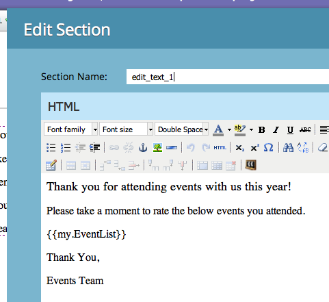

# Scripts de correo electrónico

NOTA: Se recomienda que lea la [Guía del usuario de Velocity](https://velocity.apache.org/engine/devel/user-guide.html) para profundizar en el comportamiento del lenguaje de plantilla de Velocity.

[Apache Velocity](https://velocity.apache.org/) es un lenguaje creado en Java que está diseñado para crear plantillas y scripts de contenido de HTML. Marketo permite utilizarlo en el contexto de los correos electrónicos mediante tokens de script. Esto proporciona acceso a los datos almacenados en Oportunidades y Objetos personalizados, y permite la creación de contenido dinámico en correos electrónicos. Velocity ofrece un flujo de control de alto nivel estándar con if/else, for y for each para permitir la manipulación condicional e iterativa del contenido. Este es un ejemplo sencillo de cómo imprimir un saludo con el saludo correcto:

```java
//check if the lead is male
if(${lead.MarketoSocialGender} == "Male")
    if the lead is male, use the salutation 'Mr.'
    set($greeting = "Dear Mr. ${lead.LastName},")
//check is the lead is female
elseif(${lead.MarketoSocialGender} == "Female")
    if female, use the salutation 'Ms.'
    set($greeting = "Dear Ms. ${lead.LastName},")
else
    //otherwise, use the first name
    set($greeting = "Dear ${lead.FirstName},")
end
print the greeting and some content
${greeting}

    Lorem ipsum dolor sit amet...
```

## Variables

Las variables siempre tienen el prefijo &#39;$$&#39; y se configuran y actualizan con #set:

```
#set($variable = "value")
```

Sus valores se pueden recuperar mediante varios tipos de referencia diferentes con comportamientos diferentes:

```
$variable ##outputs 'value'
$variablename ##outputs '$variablename'
${variable}name ##outputs 'valuename'
```

También existe la notación de referencia silenciosa, donde hay un `!` incluido después de `$`. Normalmente, cuando velocity encuentra una referencia indefinida, la cadena que representa la referencia se deja en su lugar. Con la notación de referencia silenciosa, si se encuentra una referencia indefinida, no se emite ningún valor:

```
##Defined Reference

#set($foo = "bar")
$foo ##outputs "bar"

##Undefined Reference

##normal
$baz ##outputs "$baz"

##quiet
$!baz ##outputs nothing
```

Para obtener más información sobre cómo hacer referencia a variables, consulte la [Guía del usuario de Apache](https://velocity.apache.org/engine/devel/user-guide.html#formal-reference-notation).

## Herramientas de Velocity

El proyecto de Apache Velocity ofrece funcionalidad mediante el uso de [Herramientas de Velocity](https://velocity.apache.org/tools/devel/apidocs/overview-summary.html). Estos son simplemente contenedores para objetos Java y exponen sus métodos a través de variables globales que están disponibles para todos los scripts.

- [HerramientaAlternador](https://velocity.apache.org/tools/devel/apidocs/org/apache/velocity/tools/generic/AlternatorTool.html)
- [ComparisonDateTool](https://velocity.apache.org/tools/devel/apidocs/org/apache/velocity/tools/generic/ComparisonDateTool.html)
- [Herramienta de conversión](https://velocity.apache.org/tools/devel/apidocs/org/apache/velocity/tools/generic/ConversionTool.html)
- [HerramientaFecha](https://velocity.apache.org/tools/devel/apidocs/org/apache/velocity/tools/generic/DateTool.html)
- [HerramientaDeVisualización](https://velocity.apache.org/tools/devel/apidocs/org/apache/velocity/tools/generic/DisplayTool.html)
- [HerramientaMatemática](https://velocity.apache.org/tools/devel/apidocs/org/apache/velocity/tools/generic/MathTool.html)
- [HerramientaNúmero](https://velocity.apache.org/tools/devel/apidocs/org/apache/velocity/tools/generic/NumberTool.html)
- [HerramientaEscape](https://velocity.apache.org/tools/devel/apidocs/org/apache/velocity/tools/generic/EscapeTool.html)
- [HerramientaBucle](https://velocity.apache.org/tools/devel/apidocs/org/apache/velocity/tools/generic/LoopTool.html)

Por ejemplo, para usar un método de `ComparisonDateTool`, acceda si desde la variable `$date` en un token de script:

```
#set($birthday = $convert.parseDate("2015-08-07","yyyy-MM-dd"))
##use whenIs to determine how many days away it is
$date.whenIs($birthday).days ##outputs 1
```

## Creación de un token de script

El script de Velocity se incluye en los correos electrónicos mediante tokens de script de correo electrónico. Pueden crearse en Actividades de marketing en una Carpeta de marketing o en un Programa. Para que se utilice un token en un correo electrónico, el correo electrónico debe ser un elemento secundario de un programa que posea el token o lo herede de una carpeta de marketing. Para crear un token, vaya a una carpeta o programa y seleccione la pestaña [!UICONTROL Mis tokens]. En el menú de la derecha, arrastre la opción &quot;Script de correo electrónico&quot; a la lista de símbolos


Desde aquí, puede editar el nombre del token y abrir el editor mediante la opción [!UICONTROL Haga clic para editar]:


Una vez que esté en el editor, puede crear un script con acceso a todas las variables en objetos accesibles mediante scripts. Para obtener una referencia de campo de un objeto, arrástrela desde el árbol derecho al script:


## Incrustación y prueba de scripts

Una vez que la secuencia de comandos esté definida dentro de un programa mi token, puede hacer referencia a ella dentro de un correo electrónico determinado mediante el editor de correo electrónico de Marketo.



Puede probar el script con la acción de correo electrónico [!UICONTROL Enviar correo electrónico de muestra] del diseñador de correo electrónico de Marketo. Para que el script se procese correctamente, debe seleccionar un posible cliente existente para suplantar en el campo [!UICONTROL Posible cliente]. Si está realizando la prueba con `$TriggerObject`, puede seleccionar el objeto desencadenante mediante el parámetro [!UICONTROL Déclencheur]. Utiliza los datos del objeto de ese tipo actualizado más recientemente como la variable `$TriggerObject`.


También puede usar la [!UICONTROL vista previa del correo electrónico] para probar el script. Para ello, debe seleccionar **[!UICONTROL Ver como: Detalle del posible cliente]** y seleccionar un posible cliente de una lista estática disponible. Esto tiene la ventaja añadida de generar cualquier excepción que se pueda haber producido durante la ejecución del script:


## Sugerencias útiles

La longitud combinada de todos los tokens de script de correo electrónico de un correo electrónico determinado no puede superar los 100 000 bytes. Este límite pertenece a la longitud total de las propias cadenas de token (no a la longitud total después de que se hayan expandido los tokens).

- Las variables a las que se hace referencia en el script de correo electrónico deben existir en Marketo en uno de los objetos disponibles para el script.
- Puede hacer referencia a objetos personalizados de primer y segundo nivel que se originan en su CRM integrado de forma nativa y que están conectados directamente al cliente potencial o contacto, pero no a objetos personalizados de tercer nivel. Los objetos personalizados no pueden ser elementos primarios del posible cliente o de la compañía
- Para los objetos personalizados de Marketo, puede hacer referencia a objetos personalizados de segundo nivel con relación principal-secundario. Por ejemplo `Lead <- Parent <- Child`. No se puede hacer referencia a objetos personalizados de segundo nivel con la relación Edge-Bridge. Por ejemplo: `Lead <- Bridge -> Edge`
- Puede hacer referencia a objetos personalizados conectados a un posible cliente, contacto o cuenta, pero no a más de uno.
- Solo se puede hacer referencia a los objetos personalizados a través de una única conexión, posible cliente, contacto o cuenta
- Debe marcar la casilla en el editor de scripts de los campos que está utilizando o no se procesarán
- Para cada objeto personalizado, los diez registros actualizados más recientemente por persona/contacto están disponibles en tiempo de ejecución y se ordenan desde los más recientes (en 0) a los más antiguos (en 9). Puede aumentar el número de registros disponibles en [siguiendo las instrucciones](https://experienceleague.adobe.com/en/docs/marketo/using/product-docs/administration/email-setup/change-custom-object-retrieval-limits-in-velocity-scripting).
- Si incluye más de un script de correo electrónico en un correo electrónico, se ejecutan de arriba a abajo. El ámbito de las variables definidas en el primer script que se ejecute estará disponible en los scripts posteriores.
- Referencia de herramientas: [https://velocity.apache.org/tools/2.0/index.html](https://velocity.apache.org/tools/2.0/index.html)
- Nota relativa a los tokens que contienen caracteres de línea nueva &quot;\\n&quot; o &quot;\\r\\n&quot;. Cuando se envía un correo electrónico mediante Enviar muestra o una campaña por lotes, los caracteres de línea nueva de los tokens se sustituyen por espacios. Cuando se envía un correo electrónico a través de la campaña de Déclencheur, los caracteres de línea nueva no se tocan.
- Para garantizar el análisis adecuado de las direcciones URL, toda la ruta debe configurarse como variable y luego imprimirse, y la variable no debe imprimirse dentro de las referencias de URL. El protocolo (http:// o https://) debe incluirse y ser independiente del resto de la dirección URL. La dirección URL también debe formar parte de una etiqueta de anclaje (<a>) completamente formada. La secuencia de comandos debe generar una etiqueta de anclaje completamente formada para que se pueda realizar el seguimiento de los vínculos. Los vínculos no se rastrearán si se generan desde dentro de un bucle for o foreach.

```html
<!-- Correct -->
#set($url = "www.example.com/${object.id}")
<a href="http://${url}">Link Text</a>

<!-- Correct -->
<a href="http://www.example.com/${object.id}">Link Text</a>

<!-- Incorrect -->
<a href="${url}">Link Text</a>

<!-- Incorrect -->
<a href="{{my.link}}">Link Text</a>

<!-- Incorrect -->
<a href="http://{{my.link}}">Link Text</a>
```
