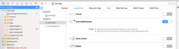

# Iónico

Integre el complemento Marketo Cordova con una aplicación [!DNL Ionic]. [!DNL Ionic] El condensador no es compatible actualmente.

## Prerrequisitos

1. [Agregue una aplicación al administrador de Marketo](https://experienceleague.adobe.com/en/docs/marketo/using/product-docs/mobile-marketing/admin/add-a-mobile-app) y obtenga la clave secreta y el Munchkin Id de la aplicación.
1. Configure notificaciones push para [iOS](push-notifications.md) o [Android](push-notifications.md).
1. Instale [[!DNL Ionic]](https://ionicframework.com/getting-started/) y [Cordova CLI](https://cordova.apache.org/docs/en/latest/guide/cli/).

## Instrucciones de instalación

### Configurar el complemento de Marketo [!DNL Ionic]

1. Vaya al directorio de aplicaciones [!DNL Ionic] y ejecute el siguiente comando para agregar el complemento de Marketo:

   `$ ionic plugin add https://github.com/Marketo/PhoneGapPlugin.git --variable APPLICATION_SECRET_KEY="YOUR_APPLICATION_SECRET"`

1. Ejecute el siguiente comando para confirmar que se ha agregado el complemento:

   `$ ionic plugin list com.marketo.plugin 0.X.0 "MarketoPlugin"`

### Migrar a una versión más reciente (opcional)

1. Para eliminar un complemento existente, ejecute el siguiente comando:

   `$ ionic plugin remove com.marketo.plugin`

1. Para volver a agregar el complemento, ejecute el siguiente comando:

   `$ ionic plugin add https://github.com/Marketo/PhoneGapPlugin.git --variable APPLICATION_SECRET_KEY="YOUR_APPLICATION_SECRET"`

### Habilitar notificaciones push en xCode

1. Active la capacidad de notificación push en el proyecto de xCode.

### Seguimiento de notificaciones push

Pegue el siguiente código dentro de la función `application:didFinishLaunchingWithOptions:`.

>[!BEGINTABS]

>[!TAB Objetivo C]

```objectivec
Marketo *sharedInstance = [Marketo sharedInstance];

[sharedInstance trackPushNotification:launchOptions];
```

>[!TAB Swift]

```swift
let sharedInstance: Marketo = Marketo.sharedInstance()

sharedInstance.trackPushNotfication(launchOptions)
```

>[!ENDTABS]

### Inicializar Marketo Framework

Para inicializar el marco de Marketo cuando se inicie la aplicación, agregue el siguiente código en la función `onDeviceReady` del archivo JavaScript principal.

Pase `ionicCordova` como el tipo de módulo para [!DNL Ionic] aplicaciones Cordova.

#### Sintaxis

```javascript
// This method will Initialize the Marketo Framework using Your MunchkinId and Secret Key
marketo.initialize(
  function() { console.log("MarketoSDK Init done."); },
  function(error) { console.log("an error occurred:" + error); },
  'YOUR_MUNCHKIN_ID',
  'YOUR_SECRET_KEY',
  'FRAMEWORK_TYPE'
);

// For session tracking, add following.
marketo.onStart(
  function(){ console.log("onStart."); },
  function(error){ console.log("Failed to report onStart." + error); }
);
```

#### Parámetros

- Llamada de retorno de éxito: función que se ejecuta si el marco de trabajo de Marketo se inicializa correctamente.
- Llamada de retorno de error: función que se ejecuta si el marco de trabajo de Marketo no se inicializa.
- MUNCHKIN ID: Munchkin ID recibido de Marketo durante el registro.
- CLAVE SECRETA: Clave secreta recibida de Marketo durante el registro.

### Inicializar notificación push de Marketo

Para inicializar las notificaciones push de Marketo, agregue el siguiente código después de la función initialize en el archivo JavaScript principal.

#### Sintaxis

```javascript
// This function will Enable user notifications (prompts the user to accept push notifications in iOS)
marketo.initializeMarketoPush(
    function() { console.log("Marketo push successfully initialized."); },
    function(error) { console.log("an error occurred:" + error); },
    'YOUR_GCM_PROJECT_ID' // This is required for Android and will be ignored in iOS
);
```

#### Parámetros

- Llamada de retorno de éxito: la función se ejecutará si la notificación push de Marketo se inicializa correctamente.
- Callback por error: función que se ejecuta si la notificación push de Marketo no se puede inicializar.
- GCM_PROJECT_ID: Se encontró el ID del proyecto GCM en [Google Developers Console](https://accounts.google.com/ServiceLogin?service=cloudconsole&passive=1209600&osid=1&continue=https://console.cloud.google.com/apis/dashboard&followup=https://console.cloud.google.com/apis/dashboard) después de crear la aplicación.

También puede anular el registro del token al cerrar la sesión.

```javascript
marketo.uninitializeMarketoPush(
  function() { console.log("Marketo push successfully uninitialized."); } ,
  function(error) { console.log("an error occurred:" + error); }
);
```

## Asociar posible cliente

Llame a la función associatedLead para crear un posible cliente de Marketo.

### Sintaxis

```javascript
marketo.associateLead(
  function(){ console.log("MarketoSDK : Lead Added"); },
  function(error){ console.log("an error occurred:" + error); },
  'Lead_Data_JSON_String'
);
```

### Parámetros

- Llamada de retorno de éxito: función que se ejecuta si el marco de trabajo de Marketo asocia correctamente al posible cliente.
- Llamada de retorno de error: función que se ejecuta si el marco de trabajo de Marketo no asocia el posible cliente.
- Datos de posibles clientes: datos de posibles clientes en formato de cadena JSON.

### Ejemplo

```javascript
// First create a lead as shown below
var lead = {};
lead[marketo.KEY_FIRST_NAME] = "Ionic";
lead[marketo.KEY_LAST_NAME] = "App";
lead[marketo.KEY_EMAIL] = email;
lead[marketo.KEY_ADDRESS] = "demo address";
lead[marketo.KEY_CITY] = "city";
lead[marketo.KEY_STATE] = "state";
lead[marketo.KEY_COUNTRY] = "country";
lead[marketo.KEY_POSTAL_CODE] = "postalCode";
lead[marketo.KEY_GENDER] = "gender";

// Use associateLead function to associate it.
marketo.associateLead(
  function() { console.log("MarketoSDK : Lead Associated"); },
  function(error) { console.log("an error occurred:" + error); },
  JSON.stringify(lead)
);
```

## Acción de informe

Llame a la función `reportaction` para informar de una acción del usuario.

### Sintaxis

```javascript
marketo.reportaction(
  function(){ console.log("MarketoSDK : New event sent "); },
  function(error){ console.log("an error occurred:" + error); },
  'Action_Name',
  'Action_Data_JSON_String'
);
```

### Parámetros

- Llamada de retorno de éxito: función que se ejecuta si el marco de trabajo de Marketo informa de la acción correctamente.
- Llamada de retorno de error: función que se ejecuta si el marco de trabajo de Marketo no informa de la acción.
- Nombre de la acción: Nombre de la acción.
- Datos de acción: datos de acción en formato de cadena JSON.

### Ejemplo

```javascript
// First create an event as below
var event = {
    "Action Type":"Add To Cart",
    "Action Details":"Adding Product in cart",
    "Action Metric":"10",
    "Action Length":"1"
}

marketo.reportaction(
    function(){ console.log("Reported action successfully."); },
    function(error){ console.log("Failed to report action." + error); },
    "Add To Cart",
    JSON.stringify(event)
);
```

## Informes de sesión

Enlace los tipos de evento de &quot;pausa&quot; y &quot;reanudación&quot; a los eventos de inicio y parada del informe. Estos eventos rastrean el tiempo empleado en la aplicación móvil y son necesarios en Android.

```javascript
//Add the following code in your www/js/index.js

bindEvents: function() {
   document.addEventListener('pause', this.onStop, false);
   document.addEventListener('resume', this.onStart, false);
},
onStop: function() {
   marketo.onStop(
       function(){ console.log("onStop"); },
       function(error){ console.log("Failed to report onStop." + error); }
   );
},
onStart: function() {
   marketo.onStart(
       function(){ console.log("onStart."); },
       function(error){console.log( "Failed to report onStart." + error); }
   );
},
```

## Creación de posibles clientes

Existen tres formas de crear posibles clientes a partir de una aplicación híbrida:

1. MARKETO MME SDK
1. API DE REST DE MARKETO
1. Envío de formulario

Los déclencheur que identifican un posible cliente nuevo dependen del método de creación:

- Los posibles clientes creados con la API de MME SDK o REST aparecen en los déclencheur y filtros &quot;Posible cliente creado&quot;.
- Los posibles clientes creados por el envío de formularios aparecen en los déclencheur y filtros &quot;Rellena el formulario&quot;.

Utilice el mismo método de creación de posibles clientes en la aplicación híbrida y en la aplicación web. Si la aplicación web utiliza el envío de formularios o la API de REST, utilice ese método en la aplicación híbrida. Si la aplicación web no utiliza ninguno de estos métodos, considere la posibilidad de utilizar MME SDK para crear posibles clientes en Marketo.
