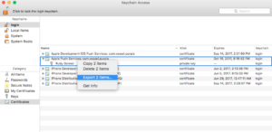
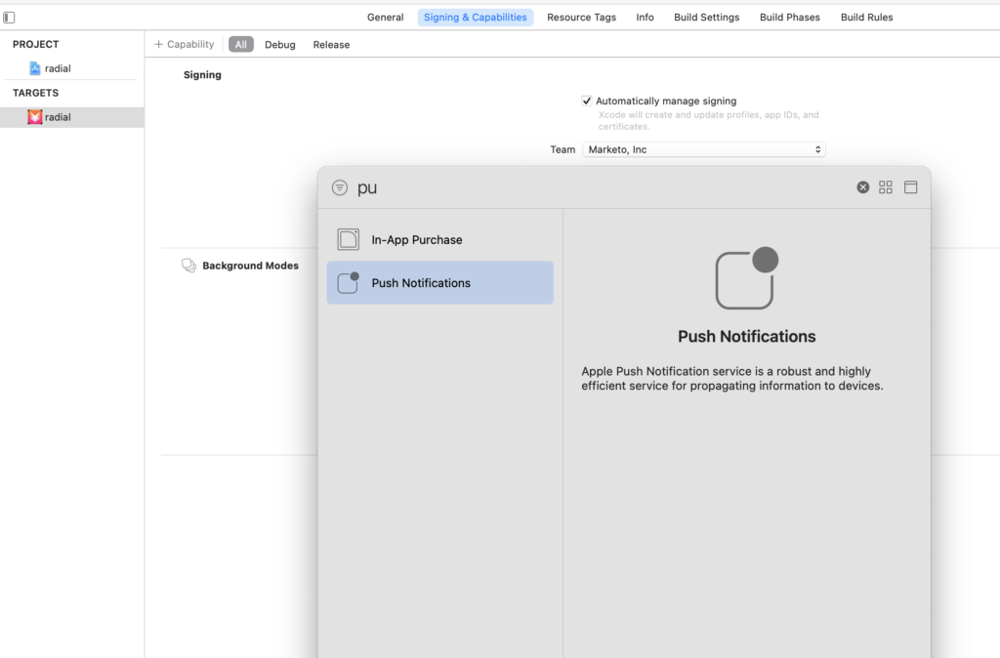

# Notificaciones push

Habilite las notificaciones push para las aplicaciones de iOS o Android que utilicen Marketo Mobile SDK.

## Configuración de notificaciones push en iOS

Para activar las notificaciones push hay que seguir tres pasos:

1. Configure las notificaciones push en su cuenta de Apple Developer.
1. Habilite las notificaciones push en xCode.
1. Habilite las notificaciones push en la aplicación con Marketo SDK.

### Configuración de notificaciones push en la cuenta de desarrollador de Apple

1. Inicie sesión en el [Centro para miembros](https://developer.apple.com/membercenter) de Apple Developer.
1. Seleccione &quot;Certificados, identificadores y perfiles&quot;.
1. Seleccione la carpeta &quot;Certificados->Todos&quot; en &quot;iOS, tvOS, watchOS&quot;.
1. Seleccione el signo + junto a certificados en la esquina superior izquierda. 
1. Seleccione &quot;SSL del servicio de notificaciones push de Apple (zona protegida y producción)&quot; y, a continuación, seleccione Continuar.
1. Seleccione el identificador de aplicación utilizado para generar la aplicación.
1. Cree y cargue una CSR para generar el certificado push. 
1. Descargue el certificado y haga doble clic en él para instalarlo. 
1. Abra &quot;Acceso a llaveros&quot;, haga clic con el botón secundario en el certificado y exporte ambos elementos al archivo `.p12`.
1. Cargue este archivo a través de Marketo Admin Console para configurar las notificaciones.
1. Actualice los perfiles de aprovisionamiento de aplicaciones.

### Habilitar notificaciones push en xCode

Active la capacidad de notificación push en el proyecto xCode.

### Habilitar notificaciones push en la aplicación con Marketo SDK

Agregue el siguiente código al archivo `AppDelegate.m` para enviar notificaciones push a los dispositivos del cliente.

**Nota** - Si usa la extensión [!DNL Adobe Launch], use `ALMarketo` como nombre de clase.

Agregar la siguiente importación a `AppDelegate.h`.

>[!BEGINTABS]

>[!TAB Objetivo C]

```objectivec
#import <UserNotifications/UserNotifications.h>
```

>[!TAB Swift]

```swift
import UserNotifications
```

>[!ENDTABS]

Agregar `UNUserNotificationCenterDelegate` a `AppDelegate` como se muestra a continuación.

>[!BEGINTABS]

>[!TAB Objetivo C]

```objectivec
@interface AppDelegate : UIResponder <UIApplicationDelegate, UNUserNotificationCenterDelegate>
```

>[!TAB Swift]

```swift
class AppDelegate: UIResponder, UIApplicationDelegate , UNUserNotificationCenterDelegate
```

>[!ENDTABS]

Agregue el siguiente código para inicializar el servicio de notificaciones push.

>[!BEGINTABS]

>[!TAB Objetivo C]

```objectivec
BOOL)application:(UIApplication *)application didFinishLaunchingWithOptions:(NSDictionary *)launchOptions {
UNUserNotificationCenter *center = [UNUserNotificationCenter currentNotificationCenter];
        center.delegate = self;
        [center requestAuthorizationWithOptions:(UNAuthorizationOptionSound | UNAuthorizationOptionAlert | UNAuthorizationOptionBadge) completionHandler:^(BOOL granted, NSError * _Nullable error){
            if(!error){
                dispatch_async(dispatch_get_main_queue(), ^{
                    [[UIApplication sharedApplication] registerForRemoteNotifications];
                });
            }
        }];

    return YES;
}
```

>[!TAB Swift]

```swift
func application(_ application: UIApplication, didFinishLaunchingWithOptions launchOptions: [UIApplication.LaunchOptionsKey: Any]?) -> Bool {

    UNUserNotificationCenter.current().requestAuthorization(options: [.alert, .sound,    .badge]) { granted, error in
            if let error = error {
                print("\(error.localizedDescription)")
            } else {
                DispatchQueue.main.async {
                    application.registerForRemoteNotifications()
                }
            }
        }

        return true
}
```

>[!ENDTABS]

Llame a este método para iniciar el registro con el servicio push de Apple. Si el registro se realiza correctamente, la aplicación llama al método `application:didRegisterForRemoteNotificationsWithDeviceToken:` del objeto delegado de la aplicación y le pasa un token de dispositivo.

Si el registro falla, la aplicación llama al método `application:didFailToRegisterForRemoteNotificationsWithError:` de su delegado de la aplicación.

Registre el token push con Marketo. El token del dispositivo debe estar registrado para recibir notificaciones push de Marketo.

>[!BEGINTABS]

>[!TAB Objetivo C]

```objectivec
- (void)application:(UIApplication *)application didRegisterForRemoteNotificationsWithDeviceToken:(NSData *)deviceToken {
    // Register the push token with Marketo
    [[Marketo sharedInstance] registerPushDeviceToken:deviceToken];
}
```

>[!TAB Swift]

```swift
func application(_ application: UIApplication, didRegisterForRemoteNotificationsWithDeviceToken deviceToken: Data) {
    // Register the push token with Marketo
    Marketo.sharedInstance().registerPushDeviceToken(deviceToken)
}
```

>[!ENDTABS]

También puede anular el registro del token cuando el usuario cierre la sesión.

>[!BEGINTABS]

>[!TAB Objetivo C]

```objectivec
[[Marketo sharedInstance] unregisterPushDeviceToken];
```

>[!TAB Swift]

```swift
Marketo.sharedInstance().unregisterPushDeviceToken
```

>[!ENDTABS]

Para volver a registrar el token push, extraiga el código del paso 3 en un método AppDelegate. Llame a ese método desde el método de inicio de sesión ViewController.

Administre la notificación push después de registrar el token del dispositivo con Marketo.

>[!BEGINTABS]

>[!TAB Objetivo C]

```objectivec
- (void)application:(UIApplication *)application didReceiveRemoteNotification:(NSDictionary *)userInfo
{
    [[Marketo sharedInstance] handlePushNotification:userInfo];
}
```

>[!TAB Swift]

```swift
func application(_ application: UIApplication, didReceiveRemoteNotification userInfo: [AnyHashable : Any]) {
    Marketo.sharedInstance().handlePushNotification(userInfo)
}
```

>[!ENDTABS]

Agregue el método siguiente a AppDelegate.

Utilice este método para mostrar una alerta, reproducir un sonido o aumentar el distintivo mientras la aplicación está en primer plano. Llame al completionHandler adecuado en este método.

>[!BEGINTABS]

>[!TAB Objetivo C]

```objectivec
-(void)userNotificationCenter:(UNUserNotificationCenter *)center
    willPresentNotification:(UNNotification *)notification
        withCompletionHandler:(void (^)(UNNotificationPresentationOptions options))completionHandler{

    completionHandler(UNAuthorizationOptionSound | UNAuthorizationOptionAlert | UNAuthorizationOptionBadge);
}
```

>[!TAB Swift]

```swift
func userNotificationCenter(_ center: UNUserNotificationCenter,
            willPresent notification: UNNotification, withCompletionHandler completionHandler: @escaping (
    UNNotificationPresentationOptions) -> Void) {
    completionHandler([.alert, .sound,.badge])
}
```

>[!ENDTABS]

Controlar las notificaciones push recién recibidas en AppDelegate.

El delegado llama a este método cuando el usuario responde a una notificación abriendo la aplicación, descartando la notificación o eligiendo UNNotificationAction. Establezca el delegado antes de que la aplicación vuelva de applicationDidFinishLaunching:.

>[!BEGINTABS]

>[!TAB Objetivo C]

```objectivec
- (void)userNotificationCenter:(UNUserNotificationCenter *)center
didReceiveNotificationResponse:(UNNotificationResponse *)response withCompletionHandler:(void(^)(void))completionHandler {
    [[Marketo sharedInstance] userNotificationCenter:center didReceiveNotificationResponse:response withCompletionHandler:completionHandler];
}
```

>[!TAB Swift]

```swift
func userNotificationCenter(_ center: UNUserNotificationCenter,
                                didReceive response: UNNotificationResponse,
                                withCompletionHandler
                                completionHandler: @escaping () -> Void) {
        Marketo.sharedInstance().userNotificationCenter(center, didReceive: response, withCompletionHandler: completionHandler)
}
```

>[!ENDTABS]

Seguimiento de notificaciones push.

Si la aplicación está en segundo plano o inactiva, el dispositivo recibe una notificación push como se muestra a continuación. Marketo realiza un seguimiento cuando el usuario selecciona la notificación.


Cuando el dispositivo recibe una notificación push, pasa la notificación a la llamada de retorno `application:didReceiveRemoteNotification:` en el delegado de la aplicación.

El siguiente registro de actividades de Marketo muestra eventos de aplicación y eventos de notificaciones push.


## Configuración de notificaciones push en Android

1. Añada los siguientes permisos dentro de la etiqueta de aplicación.

   Abra `AndroidManifest.xml` y agregue los siguientes permisos. La aplicación debe solicitar los permisos &quot;INTERNET&quot; y &quot;ACCESS_NETWORK_STATE&quot;. Omita este paso si la aplicación ya los solicita.

   ```xml
   <uses‐permission android:name="android.permission.INTERNET"/>
   <uses‐permission android:name="android.permission.ACCESS_NETWORK_STATE"/>
   
   <!‐‐Following permissions are required for push notification.‐‐>
   <uses-permission android:name="android.permission.GET_ACCOUNTS"/>
   <!‐‐Keeps the processor from sleeping when a message is received.‐‐>
   <uses-permission android:name="android.permission.WAKE_LOCK"/>
   <permission android:name="<PACKAGE_NAME>.permission.C2D_MESSAGE" android:protectionLevel="signature" />
   <uses-permission android:name="<PACKAGE_NAME>.permission.C2D_MESSAGE" />
   <!-- This app has permission to register and receive data message. -->
   <uses-permission android:name="com.google.android.c2dm.permission.RECEIVE" />
   ```

1. Configure FCM con HTTPv1.

   - Habilite MME FCM HTTPv1 en el administrador de funciones de Marketo. 
   - Cargue el archivo JSON de la cuenta de servicio para la aplicación en MLM.
   - Descargue el archivo Json de la cuenta de servicio desde la consola de Firebase. 
   - Espere una hora después de cargar el archivo JSON de la cuenta de servicio en Marketo antes de enviar notificaciones push.

## Dispositivos de prueba Android

Agregue la actividad de Marketo al archivo de manifiesto dentro de la etiqueta de aplicación.

```xml
<activity android:name="com.marketo.MarketoActivity"  android:configChanges="orientation|screenSize">
    <intent-filter android:label="MarketoActivity">
        <action  android:name="android.intent.action.VIEW"/>
        <category  android:name="android.intent.category.DEFAULT"/>
        <category  android:name="android.intent.category.BROWSABLE"/>
        <data android:host="add_test_device" android:scheme="mkto"/>
    </intent-filter/>
</activity/>
```

## Registrar el servicio push de Marketo

1. Agregue el servicio de mensajería de Firebase a `AndroidManifest.xml` antes de la etiqueta de cierre de la aplicación.

   ```xml
   <meta-data
       android:name="com.google.android.gms.version"
       android:value="@integer/google_play_services_version" />
   <service android:name=".MyFirebaseMessagingService">
   <intent-filter>
   <action android:name="com.google.firebase.INSTANCE_ID_EVENT"/>
   <action android:name="com.google.firebase.MESSAGING_EVENT"/>
   </intent-filter>
   </service>
   ```

1. Agregue los métodos de Marketo SDK a `MyFirebaseMessagingService` de la siguiente manera.

   ```java
   import com.marketo.Marketo;
   
   public class MyFirebaseMessagingService extends FirebaseMessagingService {
   
       @Override
       public void onNewToken(String s) {
           super.onNewToken(s);
           Marketo marketoSdk = Marketo.getInstance(this.getApplicationContext());
           marketoSdk.setPushNotificaitonToken(s);
           // Add your code here...
       }
   
       @Override
       public void onMessageReceived(RemoteMessage remoteMessage) {
           Marketo marketoSdk = Marketo.getInstance(this.getApplicationContext());
           marketoSdk.showPushNotificaiton(remoteMessage);
           // Add your code here...
       }
   
   }
   ```

   **Nota**: Si usa la extensión de Adobe, agregue el siguiente código.

   ```java
   import com.marketo.Marketo;
   
   public class MyFirebaseMessagingService extends FirebaseMessagingService {
   
       @Override
       public void onNewToken(String token) {
           super.onNewToken(token);
           ALMarketo.setPushNotificationToken(token);
           // Add your code here...
       }
   
       @Override
       public void onMessageReceived(RemoteMessage remoteMessage) {
           ALMarketo.showPushNotification(remoteMessage);
           // Add your code here...
       }
   
   }
   ```

**NOTA**: FCM SDK agrega automáticamente los permisos necesarios y la funcionalidad del receptor. Si ha utilizado una versión anterior de SDK, elimine los siguientes elementos obsoletos, lo que podría provocar la duplicación de mensajes.

```xml
<receiver android:name="com.marketo.MarketoBroadcastReceiver" android:permission="com.google.android.c2dm.permission.SEND">
    <intent-filter>
        <!‐‐Receives the actual messages.‐‐>
        <action android:name="com.google.android.c2dm.intent.RECEIVE"/>
        <!‐‐Register to enable push notification‐‐>
        <action android:name="com.google.android.c2dm.intent.REGISTRATION"/>
        <!‐‐‐Replace YOUR_PACKAGE_NAME with your own package name‐‐>
        <category android:name="YOUR_PACKAGE_NAME"/>
    </intent-filter>
</receiver>

<!‐‐Marketo service to handle push registration and notification‐‐>
<service android:name="com.marketo.MarketoIntentService"/>
```

1. Inicialice Marketo Push. Después de guardar la configuración, cree o abra la clase Application y agregue el código siguiente. Obtenga el ID del remitente de la consola de Firebase.

   ```java
   Marketo marketoSdk = Marketo.getInstance(getApplicationContext());
   
   // Enable push notification here. The push notification channel name can by any string
   marketoSdk.initializeMarketoPush(SENDER_ID,"ChannelName");
   ```

   Si usa la extensión [!DNL Adobe Launch], use el siguiente código.

   ```java
   // Enable push notification here. The push notification channel name can by any string
   ALMarketo.initializeMarketoPush(SENDER_ID,"ChannelName");
   ```

   Si no tiene un SENDER_ID, habilite el servicio de mensajería de Google Cloud siguiendo los pasos detallados en [este tutorial](https://developers.google.com/cloud-messaging/).

   También puede anular el registro del token cuando el usuario cierre la sesión.

   ```java
   marketoSdk.uninitializeMarketoPush();
   ```

   Si usa la extensión [!DNL Adobe Launch], use el siguiente código.

   ```java
   ALMarketo.uninitializeMarketoPush();
   ```

   Nota: Para volver a registrar el token push, extraiga el código del paso 3 en un método AppDelegate. Llame a ese método desde el método de inicio de sesión ViewController.

1. Opcional: establezca un icono de notificación. Llame al siguiente método para configurar un icono de notificación personalizado.

   ```java
   MarketoConfig.Notification config = new MarketoConfig.Notification();
   // Optional bitmap for honeycomb and above
   config.setNotificationLargeIcon(bitmap);
   
   // Required icon Resource ID
   config.setNotificationSmallIcon(R.drawable.notification_small_icon);
   
   // Set the configuration
   //Use the static methods on ALMarketo class when using Adobe Extension
   Marketo.getInstance(context).setNotificationConfig(config);
   
   // Get the configuration set
   Marketo.getInstance(context).getNotificationConfig();
   ```

## Resolución de problemas

Si los mensajes push móviles no funcionan según lo esperado, compruebe los problemas de configuración comunes antes de investigar los detalles de implementación.

### El mensaje de inserción no aparece

Compruebe si los mensajes push están desactivados en el dispositivo. Los usuarios de dispositivos móviles pueden controlar si reciben mensajes para cada aplicación, y los desarrolladores o especialistas en marketing pueden desactivar los mensajes durante el desarrollo.

Compruebe si la aplicación está abierta y activa. Cuando la aplicación está activa, los mensajes push de dispositivos móviles no aparecen en la pantalla. Aparecen en el área de &quot;notificaciones locales&quot; de la aplicación.

### Ver los registros de actividad en Marketo

Utilice los registros de actividad de Marketo para comprobar que se ha enviado un mensaje.

Revise los registros de actividad de una persona que debería haber recibido el mensaje. Si se envió el mensaje, el registro de actividad contiene un registro. Si no existe ningún registro, compruebe el certificado de iOS o la configuración de la clave de API de Android en Marketo.

### El certificado o la clave no son válidos

Compruebe que se ha cargado el certificado correcto para la zona protegida o la producción. Si es necesario, vuelva a exportar los certificados de iOS o las claves de Android y vuelva a cargarlos en Marketo.

### Falta un certificado o una clave en el archivo .p12 (iOS)

Al exportar el certificado, exporte tanto la clave como el certificado.

### Aprovisionamiento de perfiles obsoletos (iOS)

Después de agregar un dispositivo, actualice los perfiles de aprovisionamiento y genere nuevos certificados. Dirija el proyecto Xcode a los perfiles y certificados correctos e importe los certificados en Marketo.

### No Se Puede Cargar El Certificado De iOS (IOS)

Asegúrese de que la contraseña utilizada para exportar el certificado no contenga espacios. Por ejemplo, en lugar de esto:

`Hello World 123`

use esto:

`HelloWorld123`

### Solución de problemas de certificados iOS

Para las aplicaciones de zona protegida, utilice un certificado &quot;desarrollador&quot; o &quot;universal&quot;. Para aplicaciones de producción, cargue un certificado &quot;distribución&quot; o &quot;universal&quot; válido.

### Devolución de push/token no válido

Un token de registro puede no ser válido en los siguientes casos:

- Si la aplicación cliente cancela el registro con GCM.
- Si la aplicación cliente se cancela de forma automática, lo que puede ocurrir si el usuario desinstala la aplicación. Por ejemplo, en iOS, si el servicio de comentarios de APNS informaba del token de APNS como no válido.
- Si caduca el token de registro. Por ejemplo, Google puede decidir actualizar los tokens de registro o el token de APNS ha caducado para dispositivos iOS.
- Si la aplicación cliente se actualiza, pero la nueva versión no está configurada para recibir mensajes.
