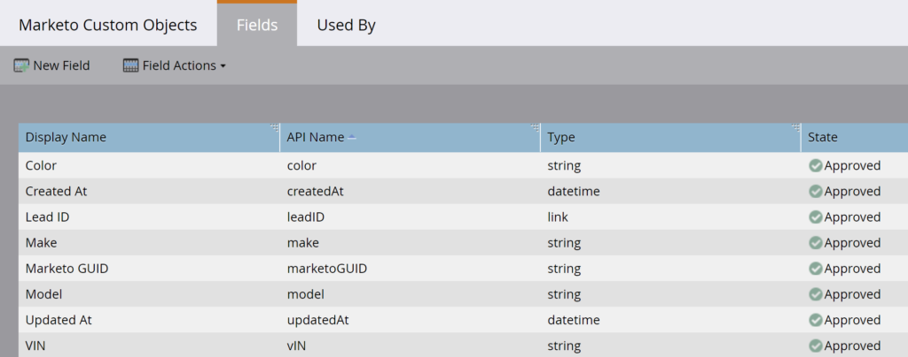

# Extracción masiva de objetos personalizados

[Referencia de extremo de extracción de objeto personalizado en lotes](https://developer.adobe.com/marketo-apis/api/mapi/#tag/Bulk-Export-Custom-Objects)

El conjunto de API de REST de extracción de objetos personalizados en lote proporciona una interfaz de programación para recuperar grandes conjuntos de registros de objetos personalizados de Marketo. Esta es la interfaz recomendada para casos de uso que requieren un intercambio continuo de datos entre Marketo y uno o más sistemas externos, para fines de ETL, almacenamiento de datos y archivo.

Esta API admite la exportación de registros de objetos personalizados de Marketo de primer nivel que están vinculados directamente a un posible cliente. Pase el nombre del objeto personalizado y una lista de posibles clientes a los que está vinculado el objeto. Para cada posible cliente de la lista, los registros de objetos personalizados vinculados que coinciden con el nombre de objeto personalizado especificado se escriben como filas en el archivo de exportación. Los datos de objeto personalizados se pueden ver en la [pestaña Objeto personalizado de la página de detalles del posible cliente en la interfaz de usuario de Marketo](https://experienceleague.adobe.com/es/docs/marketo/using/product-docs/administration/marketo-custom-objects/understanding-marketo-custom-objects).

## Permisos

Las API de extracción de objetos personalizados en lote requieren que el usuario de la API tenga una función con uno o ambos permisos &quot;Objeto personalizado de solo lectura&quot; o &quot;Objeto personalizado de lectura y escritura&quot;.

## Filtros

La extracción de objetos personalizados admite varias opciones de filtro utilizadas para especificar una lista de posibles clientes vinculados al objeto personalizado. Si un posible cliente de la lista está vinculado a registros de objeto personalizados que coinciden con un nombre de objeto personalizado determinado, los registros se escriben en el archivo de exportación. Solo se puede especificar un tipo de filtro por trabajo de exportación.

| Tipo de filtro | Tipo de datos | Notas |
|---|---|---|
| `updatedAt` | Date Range | Acepta un objeto JSON con los miembros `startAt` y `endAt` &amp;nbsp.;`startAt` acepta una fecha y hora que representa la marca de agua baja y `endAt` acepta una fecha y hora que representa la marca de agua alta. El intervalo debe ser de 31 días o menos. Los trabajos con este tipo de filtro devuelven todos los registros accesibles que se actualizaron dentro del intervalo de fechas. Las horas de la fecha deben estar en formato ISO-8601, sin milisegundos. |
| `staticListName` | Cadena | Acepta el nombre de una lista estática. Los trabajos con este tipo de filtro devuelven todos los registros accesibles que son miembros de la lista estática en el momento en que comienza a procesarse el trabajo. Recupere nombres de listas estáticas utilizando el extremo Obtener listas. |
| `staticListId` | Entero | Acepta el ID de una lista estática. Los trabajos con este tipo de filtro devuelven todos los registros accesibles que son miembros de la lista estática en el momento en que comienza a procesarse el trabajo. Recupere los identificadores de lista estática mediante el extremo Obtener listas. |
| `smartListName`* | Cadena | Acepta el nombre de una lista inteligente. Los trabajos con este tipo de filtro devuelven todos los registros accesibles que son miembros de las listas inteligentes en el momento en que comienza a procesarse el trabajo. Recupere nombres de listas inteligentes utilizando el extremo Obtener listas inteligentes. |
| `smartListId`* | Entero | Acepta el identificador de una lista inteligente. Los trabajos con este tipo de filtro devuelven todos los registros accesibles que son miembros de las listas inteligentes en el momento en que comienza a procesarse el trabajo. Recupere los identificadores de las listas inteligentes mediante el extremo Obtener listas inteligentes. |

El tipo de filtro no está disponible para algunas suscripciones. Si no está disponible para la suscripción, recibirá un error al llamar al punto final de Crear trabajo de posible cliente de exportación (&quot;1035, Tipo de filtro no compatible para la suscripción de destino&quot;). Los clientes pueden ponerse en contacto con el servicio de asistencia de Marketo para habilitar esta funcionalidad en su suscripción.

## Opciones

El extremo [Crear trabajo de exportación de objeto personalizado](https://developer.adobe.com/marketo-apis/api/mapi/#tag/Bulk-Export-Custom-Objects/operation/createExportCustomObjectsUsingPOST) proporciona varias opciones de formato. Estas opciones permiten al usuario lo siguiente:

- Especificar los campos que se incluirán en el archivo exportado
- Cambie el nombre de los encabezados de columna de estos campos
- Especifique el formato del archivo exportado

| Parámetro | Tipo de datos | Obligatorio | Notas |
|---|---|---|---|
| `fields` | Matriz[Cadena] | Sí | Matriz de cadenas que contienen el valor del nombre de atributo de objeto personalizado tal como lo devuelve el extremo Describir objeto personalizado. Los campos enumerados se incluyen en el archivo exportado. |
| `columnHeaderNames` | Objeto | No | Objeto JSON que contiene pares de clave-valor de nombres de campo y encabezado de columna. La clave debe ser el nombre de un campo incluido en el trabajo de exportación. El valor es el nombre del encabezado de columna exportado para ese campo. |
| `format` | Cadena | No | Acepta uno de: CSV, TSV, SSV. El archivo exportado se representa como un archivo de valores separados por comas, valores separados por tabulaciones o valores separados por espacios, respectivamente, si se establece. Si no se establece, el valor predeterminado es CSV. |

## Creación de un trabajo

Los parámetros del trabajo se definen antes de iniciar la exportación con el punto de conexión [Crear trabajo de exportación de objeto personalizado](https://developer.adobe.com/marketo-apis/api/mapi/#tag/Bulk-Export-Custom-Objects/operation/createExportCustomObjectsUsingPOST).

El parámetro de ruta de acceso `apiName` requerido es el nombre de objeto personalizado devuelto por el extremo [Describir objeto personalizado](https://developer.adobe.com/marketo-apis/api/mapi/#tag/Custom-Objects/operation/describeUsingGET_1). Esto especifica qué objeto personalizado de Marketo se va a exportar. No se permiten objetos personalizados de CRM. El parámetro `filter` requerido contiene la lista de posibles clientes vinculados al objeto personalizado. Esto puede hacer referencia a una lista estática o inteligente. El parámetro `fields` requerido contiene los nombres de API de los atributos de objeto personalizados que se van a incluir en el archivo de exportación. Opcionalmente, podemos definir `format` del archivo y `columnHeaderNames`.

Por ejemplo, supongamos que hemos creado un objeto personalizado llamado &quot;Coche&quot; con los siguientes campos: Color, Marca, Modelo, VIN. El campo de vínculo es el ID del posible cliente y el campo de anulación de duplicación es VIN.

Definición de objeto personalizada


Campos de objeto personalizados



Podemos llamar a [Describir objeto personalizado](https://developer.adobe.com/marketo-apis/api/mapi/#tag/Custom-Objects/operation/describeUsingGET_1) para inspeccionar mediante programación los atributos de objeto personalizados que aparecen en el atributo `fields` de la respuesta.

```
GET /rest/v1/customobjects/car_c/describe.json
```

```json
{
    "requestId": "148ef#1793e00f64f",
    "result": [
        {
            "name": "car_c",
            "displayName": "Car",
            "description": "It's a car.",
            "createdAt": "2021-05-05T16:14:41Z",
            "updatedAt": "2021-05-05T16:14:42Z",
            "idField": "marketoGUID",
            "dedupeFields": [
                "vIN"
            ],
            "searchableFields": [
                [
                    "vIN"
                ],
                [
                    "marketoGUID"
                ],
                [
                    "leadID"
                ]
            ],
            "relationships": [
                {
                    "field": "leadID",
                    "type": "child",
                    "relatedTo": {
                        "name": "Lead",
                        "field": "Id"
                    }
                }
            ],
            "fields": [
                {
                    "name": "createdAt",
                    "displayName": "Created At",
                    "dataType": "datetime",
                    "updateable": false,
                    "crmManaged": false
                },
                {
                    "name": "marketoGUID",
                    "displayName": "Marketo GUID",
                    "dataType": "string",
                    "length": 36,
                    "updateable": false,
                    "crmManaged": false
                },
                {
                    "name": "updatedAt",
                    "displayName": "Updated At",
                    "dataType": "datetime",
                    "updateable": false,
                    "crmManaged": false
                },
                {
                    "name": "color",
                    "displayName": "Color",
                    "dataType": "string",
                    "length": 255,
                    "updateable": true,
                    "crmManaged": false
                },
                {
                    "name": "leadID",
                    "displayName": "Lead ID",
                    "dataType": "integer",
                    "updateable": true,
                    "crmManaged": false
                },
                {
                    "name": "make",
                    "displayName": "Make",
                    "dataType": "string",
                    "length": 255,
                    "updateable": true,
                    "crmManaged": false
                },
                {
                    "name": "model",
                    "displayName": "Model",
                    "dataType": "string",
                    "length": 255,
                    "updateable": true,
                    "crmManaged": false
                },
                {
                    "name": "vIN",
                    "displayName": "VIN",
                    "dataType": "string",
                    "length": 255,
                    "updateable": true,
                    "crmManaged": false
                }
            ]
        }
    ],
    "success": true
}
```

Cree varios registros de objetos personalizados y vincule cada uno a un posible cliente diferente mediante el punto de conexión [Sincronizar objetos personalizados](https://developer.adobe.com/marketo-apis/api/mapi/#tag/Custom-Objects/operation/syncCustomObjectsUsingPOST). Un posible cliente se puede vincular a muchos registros de objeto personalizados. Esto se conoce como relación &quot;uno a varios&quot;.

```
POST /rest/v1/customobjects/car_c.json
```

```json
{
   "action":"createOrUpdate",
   "input":[
       {
           "leadId": 11,
           "color": "Pearl White",
           "make": "Tesla",
           "model": "Model S",
           "vIN": "5YJSA1E41FF156789"
       },
       {
           "leadId": 12,
           "color": "Midnight Silver Metallic",
           "make": "Tesla",
           "model": "Model X",
           "vIN": "LRWXB2B41FF198765"
       },
       {
           "leadId": 13,
           "color": "Fusion Red",
           "make": "Tesla",
           "model": "Roadster",
           "vIN": "SFGRC3C41FF154321"
       }
    ]
}
```

```json
{
    "requestId": "50d9#1793e066088",
    "result": [
        {
            "seq": 0,
            "marketoGUID": "d911eaa1-fd0b-4a99-9b71-c6a7233c782c",
            "status": "created"
        },
        {
            "seq": 1,
            "marketoGUID": "20d04ffb-51f0-4336-924c-c783b9bb4215",
            "status": "created"
        },
        {
            "seq": 2,
            "marketoGUID": "e7da4331-8e7a-473b-85c8-047638eb6c7f",
            "status": "created"
        }
    ],
    "success": true
}
```

Cada uno de los tres posibles clientes a los que se hace referencia arriba pertenece a una lista estática denominada &quot;Compradores de automóviles&quot; cuyo `id` es 1081, como se puede ver a continuación llamando al extremo [Obtener posibles clientes por id. de lista](https://developer.adobe.com/marketo-apis/api/mapi/#tag/Static-Lists/operation/getLeadsByListIdUsingGET_1).

```
GET /rest/v1/lists/1081/leads.json
```

```json
{
    "requestId": "d023#1793e1e982b",
    "result": [
        {
            "id": 11,
            "firstName": "Hanna",
            "lastName": "Crawford",
            "email": "208161Hanna.Crawford@pookmail.com",
            "updatedAt": "2020-01-16T02:38:22Z",
            "createdAt": "2017-07-27T01:38:42Z"
        },
        {
            "id": 12,
            "firstName": "Bertha",
            "lastName": "Fulton",
            "email": "208160Bertha.Fulton@trashymail.com",
            "updatedAt": "2020-01-16T02:38:22Z",
            "createdAt": "2017-07-27T01:38:42Z"
        },
        {
            "id": 13,
            "firstName": "Faith",
            "lastName": "England",
            "email": "208159Faith.England@dodgit.com",
            "updatedAt": "2020-01-16T02:38:22Z",
            "createdAt": "2017-07-27T01:38:42Z"
        }
    ],
    "success": true
}
```

Ahora vamos a crear un trabajo de exportación para recuperar estos registros. Al usar el extremo [Crear trabajo de exportación de objeto personalizado](https://developer.adobe.com/marketo-apis/api/mapi/#tag/Bulk-Export-Custom-Objects/operation/createExportCustomObjectsUsingPOST), especificamos atributos de objeto personalizados en el parámetro `fields` y un identificador de lista estática en el parámetro `filter`.

```
POST /bulk/v1/customobjects/car_c/export/create.json
```

```json
{
    "fields": [
        "leadId",
        "color",
        "make",
        "model",
        "vIN"
    ],
    "filter": {
        "staticListId": 1081
    }
}
```

```json
{
    "requestId": "8d2f#1793e289e87",
    "result": [
        {
            "exportId": "f2c03f1d-226f-47c1-a557-357af8c2b32a",
            "format": "CSV",
            "status": "Created",
            "createdAt": "2021-05-05T20:12:01Z"
        }
    ],
    "success": true
}
```

Devuelve un estado en la respuesta que indica que el trabajo se ha creado. Se ha definido y creado el trabajo, pero aún no se ha iniciado. Para ello, se debe llamar al extremo [Enqueue Export Custom Object Job](https://developer.adobe.com/marketo-apis/api/mapi/#tag/Bulk-Export-Custom-Objects/operation/enqueueExportCustomObjectsUsingPOST) mediante `apiName` y `exportId` desde la respuesta de estado de creación.

```
POST /bulk/v1/customobjects/car_c/export/f2c03f1d-226f-47c1-a557-357af8c2b32a/enqueue.json
```

```json
{
    "requestId": "cfaf#1793e2a0762",
    "result": [
        {
            "exportId": "f2c03f1d-226f-47c1-a557-357af8c2b32a",
            "format": "CSV",
            "status": "Queued",
            "createdAt": "2021-05-05T20:12:01Z",
            "queuedAt": "2021-05-05T20:13:32Z"
        }
    ],
    "success": true
}
```

Esto responde con un `status` inicial de &quot;En cola&quot; después del cual se establece en &quot;Procesando&quot; cuando hay una ranura de exportación disponible.

## Estado del trabajo de sondeo

El estado solo se puede recuperar para trabajos creados por el mismo usuario de API.

Dado que este es un extremo asincrónico, después de crear el trabajo debemos sondear su estado para determinar su progreso. Encuesta usando el punto de conexión [Obtener estado de trabajo de exportación de objeto personalizado](https://developer.adobe.com/marketo-apis/api/mapi/#tag/Bulk-Export-Custom-Objects/operation/getExportCustomObjectsStatusUsingGET). El estado solo se actualiza una vez cada 60 segundos, por lo que no se recomienda una frecuencia de sondeo inferior a esta, y en casi todos los casos sigue siendo excesiva. El campo de estado puede responder con cualquiera de las siguientes opciones: Creado, En cola, Procesando, Cancelado, Completado o Error.

```
GET /bulk/v1/customobjects/{apiName}/export/{exportId}/status.json
```

```json
{
    "requestId": "14daa#1793e2cf9de",
    "result": [
        {
            "exportId": "f2c03f1d-226f-47c1-a557-357af8c2b32a",
            "format": "CSV",
            "status": "Processing",
            "createdAt": "2021-05-05T20:12:01Z",
            "queuedAt": "2021-05-05T20:13:32Z",
            "startedAt": "2021-05-05T20:14:15Z"
        }
    ],
    "success": true
}
```

El punto final de estado responde indicando que el trabajo aún se está procesando, por lo que el archivo aún no está disponible para su recuperación. Una vez que el trabajo `status` cambie a &quot;Completado&quot;, estará disponible para su descarga.

```json
{
    "requestId": "14daa#1793e2cf9de",
    "result": [
        {
            "exportId": "f2c03f1d-226f-47c1-a557-357af8c2b32a",
            "format": "CSV",
            "status": "Completed",
            "createdAt": "2021-05-05T20:12:01Z",
            "queuedAt": "2021-05-05T20:13:32Z",
            "startedAt": "2021-05-05T20:14:15Z",
            "finishedAt": "2021-05-05T20:14:28Z",
            "numberOfRecords": 3,
            "fileSize": 182,
            "fileChecksum": "sha256:fac0cabc2352229c12e18b2fde03d1f24178bc71e9e926f520ae8d61bbe98c01"
        }
    ],
    "success": true
}
```

## Recuperación de datos

Para recuperar el archivo de una exportación de objeto personalizado completada, simplemente llame al extremo [Obtener archivo de objeto personalizado de exportación](https://developer.adobe.com/marketo-apis/api/mapi/#tag/Bulk-Export-Custom-Objects/operation/getExportCustomObjectsFileUsingGET) con sus `apiName` y `exportId`.

La respuesta contiene un archivo con el formato que tenía el trabajo configurado. El punto final responde con el contenido del archivo. Si un atributo de objeto personalizado solicitado está vacío (no contiene datos), `null` se coloca en el campo correspondiente del archivo de exportación.

```
GET /bulk/v1/customobjects/car_c/export/f2c03f1d-226f-47c1-a557-357af8c2b32a/file.json
```

```csv
leadId,color,make,model,vIN
11,Pearl White,Tesla,Model S,5YJSA1E41FF156789
12,Midnight Silver Metallic,Tesla,Model X,LRWXB2B41FF198765
13,Fusion Red,Tesla,Roadster,SFGRC3C41FF154321
```

Para admitir la recuperación parcial y fácil de reanudar de los datos extraídos, el extremo de archivo admite opcionalmente el encabezado HTTP `Range` del tipo `bytes`. Si no se establece el encabezado, se devuelve todo el contenido. Puede obtener más información sobre el uso del encabezado Rango en Marketo [Extracción en lotes](bulk-extract.md).

## Cancelación de un trabajo

Si un trabajo se configuró incorrectamente o se vuelve innecesario, se puede cancelar fácilmente usando el punto de conexión [Cancelar trabajo de exportar objeto personalizado](https://developer.adobe.com/marketo-apis/api/mapi/#tag/Bulk-Export-Custom-Objects/operation/getExportCustomObjectsFileUsingPOST). Esto responde con un `status` que indica que el trabajo se ha cancelado.

```
POST /bulk/v1/customobjects/car_c/export/f2c03f1d-226f-47c1-a557-357af8c2b32a/cancel.json
```

```json
{
    "requestId": "e5f9#179391286a7",
    "result": [
        {
            "exportId": "4a8cdd80-0d16-4dd6-9923-6ec97e30e91b",
            "format": "CSV",
            "status": "Cancelled",
            "createdAt": "2021-05-04T20:24:33Z"
        }
    ],
    "success": true
}
```
