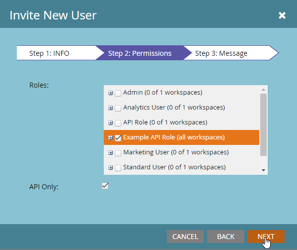
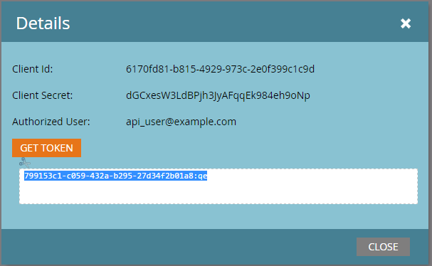

# Servicios personalizados

Un servicio personalizado proporciona credenciales para autenticarse con Marketo. Se necesitan credenciales para obtener un token de acceso del [servicio de identidad](https://developer.adobe.com/marketo-apis/api/identity/#tag/Identity/operation/identityUsingGET) de Marketo. Cada servicio personalizado tiene un ámbito de un único usuario de solo API del que deriva sus permisos.

## Roles

El primer paso para crear un servicio personalizado es crear una función que pueda aplicar al usuario solo de API correspondiente. Esto se hace desde el menú **[!UICONTROL Administración]** > **[!UICONTROL Usuarios y roles]** > **[!UICONTROL Roles]**.

Las funciones son contenedores para permisos individuales que permiten o restringen el acceso a determinadas funciones. En las suscripciones que tienen espacios de trabajo y particiones habilitados, los permisos se otorgan por espacio de trabajo. Si un usuario tiene un permiso en un espacio de trabajo pero no en otro, solo podrá realizar acciones permitidas en ese espacio de trabajo. Para crear una función, haga clic en el botón Nueva función.

Asegúrese de asignar un nombre descriptivo a la función. Los usuarios solo de API tienen un conjunto específico de permisos que son independientes y distintos de los permisos de usuario normales. Los permisos de API existen en su propia jerarquía debajo del árbol &quot;API de acceso&quot;.

### Permisos de roles

Solo los permisos del grupo &quot;API de acceso&quot; se aplican a los usuarios de la API; es decir, la concesión de todos los permisos de administración no concederá permisos de API a un usuario.

Cuando cree una función, piense detenidamente qué acciones debe permitir que haga la aplicación que la utiliza. Conceda únicamente el conjunto mínimo de permisos necesarios para llevar a cabo esas acciones. Al permitir un conjunto de permisos innecesariamente permisivo, las integraciones pueden realizar acciones no deseadas en la suscripción. Puede usar la [herramienta de permisos](endpoint-reference.md) para determinar el conjunto mínimo de permisos. Ver la lista completa de [permisos](#permission_list).

## Usuarios

Después de crear una función, debe crear un usuario &quot;Solo API&quot;. Los usuarios solo de API son un tipo especial de usuario en Marketo, ya que son administrados por otros usuarios y no se pueden usar para iniciar sesión en Marketo. Los usuarios solo de API pueden:

- Crear servicios personalizados
- Permisos de ámbito para esos servicios
- Acceso a API de REST

>[!MORELIKETHIS]
>
>Para crear un usuario solo de API, ve al menú **[!UICONTROL Administración]** > **[!UICONTROL Usuarios y roles]** > **[!UICONTROL Usuarios]** y haz clic en [!UICONTROL Invitar nuevo usuario].

Asigne a su usuario un nombre descriptivo y una dirección de correo electrónico (no debe ser válida), según el servicio y la aplicación para los que se utilizará. Rellene los campos obligatorios en el menú del cuadro de diálogo, haga clic en la casilla &quot;Solo API&quot; y asigne una de las funciones de API al usuario. Esto asigna los permisos de esa función establecidos al usuario.

Finalmente, haga clic en &quot;Enviar&quot; para crear el usuario solo de API.

Al aprovisionar una nueva aplicación con credenciales, considere seriamente la posibilidad de crear un nuevo usuario para el servicio aunque tenga el mismo conjunto de permisos que otra integración existente. Las estadísticas y los errores de uso de llamadas de API se rastrean por usuario, por lo que el aprovisionamiento de un usuario para cada aplicación puede ayudarle a aislar el uso y los problemas en aplicaciones específicas. Esto resulta útil si tiene problemas para establecer los límites diarios de llamadas a la API o errores resultantes de llamadas a la API realizadas por integraciones.

## Servicios personalizados

Los servicios personalizados proporcionan las credenciales reales, el ID de cliente y el Secreto de cliente, necesarios para realizar la autenticación con una instancia de Marketo. Para aprovisionar uno, ve al menú de **[!UICONTROL Administración]** > **[!UICONTROL Integraciones]** > **[!UICONTROL LaunchPoint]** y selecciona **[!UICONTROL Nuevo servicio]**.

Asigne un nombre descriptivo al servicio y, en la lista Servicio, seleccione Personalizado. Proporcione a su servicio una descripción detallada, seleccione un usuario apropiado en la lista Usuario solo de API y luego haga clic en [!UICONTROL Crear].

Esto añade un nuevo servicio a la lista de servicios de LaunchPoint y la opción de &quot;Ver detalles&quot;. Haga clic en &quot;Ver detalles&quot; y recibirá el ID de cliente y el secreto de cliente necesarios para la autenticación, el usuario propietario y una opción para obtener el token a fin de realizar pruebas a corto plazo. El token que obtiene de este cuadro de diálogo tiene la misma duración que los tokens obtenidos normalmente del [servicio de identidad](https://developer.adobe.com/marketo-apis/api/identity/#tag/Identity/operation/identityUsingGET) y es válido durante 3.600 segundos a partir de la creación.

## Espacios de trabajo y particiones

En las suscripciones con espacios de trabajo y particiones, la capacidad de acceder a un registro o recurso determinado se concede en función de los permisos que tiene la función de un usuario en un espacio de trabajo determinado. Cada espacio de trabajo tiene acceso a una o más particiones del menú Espacios de trabajo y particiones, y un posible cliente pertenece a una sola partición. Si el usuario solo de API tiene acceso para leer o escribir registros de posibles clientes en un espacio de trabajo, puede acceder a todos los registros de las particiones a las que tiene acceso ese espacio de trabajo.

Assets pertenece a espacios de trabajo, por lo que la capacidad de leer o escribir un recurso viene determinada por si el usuario tiene una función en el espacio de trabajo correspondiente que tenga permiso para leer o escribir ese tipo de registro de recurso en el espacio de trabajo.

## Lista de permisos

A continuación se muestra una lista de todos los permisos disponibles para los usuarios solo de API y qué pueden hacer los usuarios con ese permiso.

| Permiso de rol | Concede acceso a... |
| --- | --- |
| Aprobar recursos | Aprobar recursos |
| Ejecutar campaña | Solicitud o programación de una campaña |
| Actividad de solo lectura | Recuperar actividades de posibles clientes |
| Metadatos de la actividad de solo lectura | Recuperar metadatos de actividad de posible cliente |
| Recursos de solo lectura | Recuperar detalles del recurso |
| Campaña de solo lectura | Recuperar detalles de campaña |
| Compañía de solo lectura | Recuperar detalles de empresa |
| Objeto personalizado de solo lectura | Recuperar detalles de objeto personalizados |
| Guía de solo lectura | Recuperar detalles del posible cliente |
| Cuenta nombrada de solo lectura | Recuperar detalles de la cuenta con nombre |
| Lista de cuentas nombradas de solo lectura | Recuperar detalles de lista de cuentas con nombre |
| Oportunidad de solo lectura | Recuperar detalles de la oportunidad |
| Persona de ventas de solo lectura | Recuperar detalles del vendedor |
| Actividad de solo escritura | Recuperación y creación de actividades de posibles clientes |
| Metadatos de la actividad de escritura y lectura | Recuperar y crear metadatos de actividades de posibles clientes |
| Recursos habilitados para lectura y escritura | Recuperación, creación y actualización de recursos |
| Campaña habilitada para lectura y escritura | Recuperación, creación y actualización de campañas |
| Compañía habilitada para lectura y escritura | Recuperar, crear y actualizar compañías |
| Objeto personalizado habilitado para lectura y escritura | Recuperar, crear y actualizar objetos personalizados |
| Guía de solo escritura | Recuperar, crear y actualizar detalles del posible cliente |
| Cuenta nombrada de lectura y escritura | Recuperar, crear y actualizar cuentas con nombre |
| Lista de cuentas nombradas habilitadas para lectura y escritura | Recuperar, crear y actualizar listas de cuentas con nombre |
| Oportunidad habilitada para lectura y escritura | Recuperar, crear y actualizar oportunidades |
| Persona de ventas habilitada para lectura y escritura | Recuperación, creación y actualización de vendedores |
