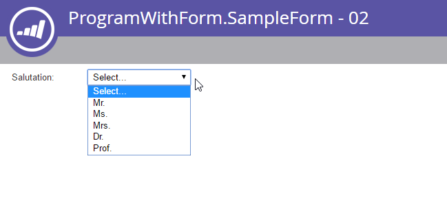

# Formularios

[Referencia de extremo de Forms](https://developer.adobe.com/marketo-apis/api/asset#tag/Forms)

[Referencia de extremo de campos de formulario](https://developer.adobe.com/marketo-apis/api/asset#tag/Form-Fields)

Utilice los extremos de los formularios para administrar formularios de sistemas remotos. Un formulario puede incluir varios tipos de objetos:

- Formularios
- Campos
- Fieldsets
- Reglas de visibilidad
- Reglas de página de seguimiento

## Consulta

Forms admite los métodos de recuperación de recursos estándar: [por id](https://developer.adobe.com/marketo-apis/api/asset#tag/Forms/operation/getLpFormByIdUsingGET), [por nombre](https://developer.adobe.com/marketo-apis/api/asset#tag/Forms/operation/getLpFormByNameUsingGET) y por [exploración](https://developer.adobe.com/marketo-apis/api/asset#tag/Forms/operation/browseForms2UsingGET). Una respuesta de formulario contiene todas las propiedades del formulario excepto la lista de campos.

### Por identificador

Pase un formulario `id` como parámetro de ruta de acceso a [Obtener formulario por identificador](https://developer.adobe.com/marketo-apis/api/asset#tag/Forms/operation/getLpFormByIdUsingGET). El extremo devuelve el registro de formulario coincidente.

```http
GET /rest/asset/v1/form/{id}.json
```

```json
{
    "success": true,
    "warnings": [],
    "errors": [],
    "requestId": "948f#154e3bad8e3",
    "result": [
        {
            "id": 736,
            "name": "newForm",
            "description": "test",
            "createdAt": "2016-05-24T17:05:54Z+0000",
            "updatedAt": "2016-05-24T17:05:54Z+0000",
            "url": "https://app-devlocal1.marketo.com/#FO736B2",
            "status": "draft",
            "theme": "simple",
            "language": "French",
            "locale": "fr_FR",
            "progressiveProfiling": false,
            "labelPosition": "left",
            "fontFamily": "Helvetica",
            "fontSize": "13px",
            "folder": {
                "type": "Folder",
                "value": 293,
                "folderName": "yyLNLHzgOM"
            },
            "knownVisitor": {
                "type": "form",
                "template": null
            },
            "thankYouList": [
                {
                    "followupType": "none",
                    "followupValue": null,
                    "default": true
                }
            ],
            "buttonLocation": 120,
            "buttonLabel": "Envoyer",
            "waitingLabel": "Veuillez patienter"
        }
    ]
}
```

### Por nombre

Pase un formulario `name` a [Obtener formulario por nombre](https://developer.adobe.com/marketo-apis/api/asset#tag/Forms/operation/getLpFormByNameUsingGET). El extremo devuelve el registro de formulario coincidente.

```http
GET /rest/asset/v1/form/byName.json?name=newForm
```

```json
{
    "success": true,
    "warnings": [],
    "errors": [],
    "requestId": "948f#154e3bad8e3",
    "result": [
        {
            "id": 736,
            "name": "newForm",
            "description": "test",
            "createdAt": "2016-05-24T17:05:54Z+0000",
            "updatedAt": "2016-05-24T17:05:54Z+0000",
            "url": "https://app-devlocal1.marketo.com/#FO736B2",
            "status": "draft",
            "theme": "simple",
            "language": "French",
            "locale": "fr_FR",
            "progressiveProfiling": false,
            "labelPosition": "left",
            "fontFamily": "Helvetica",
            "fontSize": "13px",
            "folder": {
                "type": "Folder",
                "value": 293,
                "folderName": "yyLNLHzgOM"
            },
            "knownVisitor": {
                "type": "form",
                "template": null
            },
            "thankYouList": [
                {
                    "followupType": "none",
                    "followupValue": null,
                    "default": true
                }
            ],
            "buttonLocation": 120,
            "buttonLabel": "Envoyer",
            "waitingLabel": "Veuillez patienter"
        }
    ]
}
```

### Examinar

[Obtener Forms](https://developer.adobe.com/marketo-apis/api/asset#tag/Forms/operation/browseForms2UsingGET) sigue el patrón de exploración estándar de la API de recursos. Admite estos filtros opcionales:

- `status`: Filtros por `approved`, `approved with draft` o `draft`.
- `maxReturn`: limita el número de registros devueltos.
- `offset`: páginas a través del conjunto de resultados.

```http
GET /rest/asset/v1/forms.json
```

```json
{
    "success": true,
    "warnings": [],
    "errors": [],
    "requestId": "645d#154e3d499ac",
    "result": [
        {
            "id": 227,
            "name": "aKAUVDfbsX",
            "description": "",
            "createdAt": "2016-05-18T20:36:20Z+0000",
            "updatedAt": "2016-05-18T20:36:20Z+0000",
            "url": "https://app-devlocal1.marketo.com/#FO227B2",
            "status": "draft",
            "theme": "simple",
            "language": "English",
            "locale": "en_US",
            "progressiveProfiling": false,
            "labelPosition": "left",
            "fontFamily": "Helvetica",
            "fontSize": "13px",
            "folder": {
                "type": "Folder",
                "value": 293,
                "folderName": "yyLNLHzgOM"
            },
            "knownVisitor": {
                "type": "form",
                "template": null
            },
            "thankYouList": [
                {
                    "followupType": "none",
                    "followupValue": null,
                    "default": true
                }
            ],
            "buttonLocation": 120,
            "buttonLabel": "Submit",
            "waitingLabel": "Please Wait"
        },
        {
            "id": 695,
            "name": "AoMXgfFbma",
            "description": "",
            "createdAt": "2016-05-19T18:50:40Z+0000",
            "updatedAt": "2016-05-19T18:50:40Z+0000",
            "url": "https://app-devlocal1.marketo.com/#FO695B2",
            "status": "draft",
            "theme": "simple",
            "language": "English",
            "locale": "en_US",
            "progressiveProfiling": true,
            "labelPosition": "left",
            "fontFamily": "Helvetica",
            "fontSize": "13px",
            "folder": {
                "type": "Folder",
                "value": 565,
                "folderName": "WfUvYmlcyT"
            },
            "knownVisitor": {
                "type": "form",
                "template": null
            },
            "thankYouList": [
                {
                    "followupType": "none",
                    "followupValue": null,
                    "default": true
                }
            ],
            "buttonLocation": 120,
            "buttonLabel": "Submit",
            "waitingLabel": "Please Wait"
        }
    ]
}
```

### Lista de campos

Recupere la lista de campos por separado para cada formulario pasando el ID de formulario.

```http
GET /rest/asset/v1/form/{id}/fields.json
```

```json
{
    "success": true,
    "warnings": [],
    "errors": [],
    "requestId": "2165#154eee00d01",
    "result": [
        {
            "id": "FirstName",
            "label": "First Name:",
            "dataType": "text",
            "validationMessage": "This field is required.",
            "rowNumber": 0,
            "columnNumber": 0,
            "maxLength": 255,
            "required": false,
            "formPrefill": true,
            "visibilityRules": {
                "ruleType": "alwaysShow"
            }
        },
        {
            "id": "LastName",
            "label": "Last Name:",
            "dataType": "text",
            "validationMessage": "This field is required.",
            "rowNumber": 1,
            "columnNumber": 0,
            "maxLength": 255,
            "required": false,
            "formPrefill": true,
            "visibilityRules": {
                "ruleType": "alwaysShow"
            }
        },
        {
            "id": "Email",
            "label": "Email Address:",
            "dataType": "email",
            "validationMessage": "Must be valid email. <span class='mktoErrorDetail'>example@yourdomain.com</span>",
            "rowNumber": 2,
            "columnNumber": 0,
            "required": false,
            "formPrefill": true,
            "visibilityRules": {
                "ruleType": "alwaysShow"
            }
        },
        {
            "id": "Profiling",
            "dataType": "profiling",
            "rowNumber": 3,
            "columnNumber": 0
        }
    ]
}
```

Antes de actualizar o eliminar campos o cambiar su comportamiento, recupere la lista de campos del formulario. Utilice el ID de campo devuelto en las solicitudes posteriores.

### Tipos de campo

| Tipo de IU | Nombre de API |
| --- | --- |
| Casillas de verificación | casilla de verificación |
| Botón de opción | radio |
| Área de texto | área de texto |
| Lista de selección | lista desplegable |
| Cadena | cadena |
| Correo electrónico | correo electrónico |
| Fecha | fecha |
| Número | número |
| Doble | doble |
| Teléfono | teléfono |
| URL | url |
| Moneda | currency |
| Casilla de verificación | single_checkbox |
| Control deslizante | intervalo |

### Dependencias

Pase un formulario `id` como parámetro de ruta de acceso a [Obtener formulario utilizado por](https://developer.adobe.com/marketo-apis/api/asset#tag/Forms/operation/getFormUsedByUsingGET). El extremo devuelve recursos que dependen del formulario.

Los siguientes tipos de recursos pueden utilizar formularios:

- Páginas de destino
- Listas inteligentes
- Campañas inteligentes
- Informes
- Programas de correo electrónico

```http
GET /rest/asset/v1/form/{id}/usedBy.json
```

```json
{
    "success": true,
    "errors": [],
    "requestId": "fdf4#17285b25038",
    "warnings": [],
    "result": [
        {
            "id": 1038,
            "name": "LP Redirect Rules Program.LP Test 01",
            "type": "Landing Page",
            "status": "approved",
            "updatedAt": "2020-02-23T01:31:21Z+0000"
        }
    ]
}
```

## Crear y actualizar

Para [crear un formulario](https://developer.adobe.com/marketo-apis/api/asset#tag/Forms/operation/createLpFormsUsingPOST), proporcione dos campos obligatorios:

- La carpeta principal del formulario.
- El nombre del formulario.

Todos los demás parámetros son opcionales y tienen valores predeterminados. Un nuevo formulario incluye tres campos predeterminados: Nombre, Apellidos y Correo electrónico.

```http
POST /rest/asset/v1/forms.json
```

```text
Content-Type: application/x-www-form-urlencoded
```

```text
name=newForm&description=test&folder={"type": "Folder","id": 293}&language=French
```

```json
{
    "success": true,
    "warnings": [],
    "errors": [],
    "requestId": "948f#154e3bad8e3",
    "result": [
        {
            "id": 736,
            "name": "newForm",
            "description": "test",
            "createdAt": "2016-05-24T17:05:54Z+0000",
            "updatedAt": "2016-05-24T17:05:54Z+0000",
            "url": "https://app-devlocal1.marketo.com/#FO736B2",
            "status": "draft",
            "theme": "simple",
            "language": "French",
            "locale": "fr_FR",
            "progressiveProfiling": false,
            "labelPosition": "left",
            "fontFamily": "Helvetica",
            "fontSize": "13px",
            "folder": {
                "type": "Folder",
                "value": 293,
                "folderName": "yyLNLHzgOM"
            },
            "knownVisitor": {
                "type": "form",
                "template": null
            },
            "thankYouList": [
                {
                    "followupType": "none",
                    "followupValue": null,
                    "default": true
                }
            ],
            "buttonLocation": 120,
            "buttonLabel": "Envoyer",
            "waitingLabel": "Veuillez patienter"
        }
    ]
}
```

Para [actualizar un formulario](https://developer.adobe.com/marketo-apis/api/asset#tag/Forms/operation/updateFormsUsingPOST), pase su ID. Durante la creación o actualización, puede establecer los parámetros de estilo base que controlan cómo aparece el formulario para el usuario.

```http
POST /rest/asset/v1/form/736.json
```

```text
Content-Type: application/x-www-form-urlencoded
```

```text
name=updated name&description=This is a test for updateapi&language=English&progressiveProfiling=true&locale=en_US
```

```json
{
    "success": true,
    "warnings": [],
    "errors": [],
    "requestId": "6307#154e3cf6efe",
    "result": [
        {
            "id": 736,
            "name": "updated name",
            "description": "This is a test for update api",
            "createdAt": "2016-05-24T17:05:54Z+0000",
            "updatedAt": "2016-05-24T17:28:23Z+0000",
            "status": "draft",
            "theme": "simple",
            "language": "English",
            "locale": "en_US",
            "progressiveProfiling": true,
            "labelPosition": "left",
            "fontFamily": "Helvetica",
            "fontSize": "13px",
            "folder": {
                "type": "Folder",
                "value": 293,
                "folderName": "yyLNLHzgOM"
            },
            "knownVisitor": {
                "type": "form",
                "template": null
            },
            "thankYouList": [
                {
                    "followupType": "none",
                    "followupValue": null,
                    "default": true
                }
            ],
            "buttonLocation": 120,
            "buttonLabel": "Submit",
            "waitingLabel": "Please Wait"
        }
    ]
}
```

Los extremos de formulario de creación y actualización no modifican el comportamiento conocido de los visitantes o de la página de agradecimiento. Utilice los extremos correspondientes para administrar esos comportamientos.

## Metadatos de campo

Antes de agregar o editar campos de formulario, recupere los campos válidos para la instancia de destino. Las operaciones de campo utilizan la propiedad `id` devuelta para cada campo.

Para los campos de posible cliente, use el extremo [Obtener campos de formulario disponibles](https://developer.adobe.com/marketo-apis/api/asset#tag/Form-Fields/operation/getAllFieldsUsingGET). La respuesta incluye el tipo de datos de cada campo y los metadatos predeterminados aplicados cuando el campo se agrega a un formulario.

```http
GET /rest/asset/v1/form/fields.json
```

```json
{
    "success": true,
    "errors": [],
    "requestId": "176ca#167a9808f4c",
    "warnings": [],
    "result": [
        {
            "id": "AnnualRevenue",
            "isRequired": false,
            "dataType": "currency"
        },
        {
            "id": "City",
            "isRequired": false,
            "dataType": "string",
            "maxLength": 255
        },
        {
            "id": "Company",
            "isRequired": false,
            "dataType": "string",
            "maxLength": 255
        },
        {
            "id": "Country",
            "isRequired": false,
            "dataType": "string",
            "maxLength": 255
        },
        {
            "id": "Description",
            "isRequired": false,
            "dataType": "textarea",
            "maxLength": 32000,
            "visibleRows": 2
        },
        {
            "id": "Email",
            "isRequired": false,
            "dataType": "email"
        },
        {
            "id": "Fax",
            "isRequired": false,
            "dataType": "phone"
        },
        {
            "id": "FirstName",
            "isRequired": false,
            "dataType": "string",
            "maxLength": 255
        },
        {
            "id": "Industry",
            "isRequired": false,
            "dataType": "string",
            "maxLength": 255
        },
        {
            "id": "LastName",
            "isRequired": false,
            "dataType": "string",
            "maxLength": 255
        },
        {
            "id": "LeadSource",
            "isRequired": false,
            "dataType": "string",
            "maxLength": 255
        },
        {
            "id": "MobilePhone",
            "isRequired": false,
            "dataType": "phone"
        },
        {
            "id": "NumberOfEmployees",
            "isRequired": false,
            "dataType": "int"
        },
        {
            "id": "Phone",
            "isRequired": false,
            "dataType": "phone"
        },
        {
            "id": "PostalCode",
            "isRequired": false,
            "dataType": "string",
            "maxLength": 255
        },
        {
            "id": "Rating",
            "isRequired": false,
            "dataType": "string",
            "maxLength": 255
        },
        {
            "id": "Salutation",
            "isRequired": false,
            "dataType": "picklist",
            "picklistValues": "Mr.,Ms.,Mrs.,Dr.,Prof."
        },
        {
            "id": "State",
            "isRequired": false,
            "dataType": "picklist",
            "picklistValues": "AK::AK,AL::AL,AR::AR,AZ::AZ,CA::CA,CO::CO,CT::CT,DE::DE,FL::FL,GA::GA,HI::HI,IA::IA,ID::ID,IL::IL,IN::IN,KS::KS,KY::KY,LA::LA,MA::MA,MD::MD,ME::ME,MI::MI,MN::MN,MO::MO,MS::MS,MT::MT,NC::NC,ND::ND,NE::NE,NH::NH,NJ::NJ,NM::NM,NV::NV,NY::NY,OH::OH,OK::OK,OR::OR,PA::PA,RI::RI,SC::SC,SD::SD,TN::TN,TX::TX,UT::UT,VA::VA,VT::VT,WA::WA,WI::WI,WV::WV,WY::WY"
        },
        {
            "id": "Street",
            "isRequired": false,
            "dataType": "textarea",
            "maxLength": 2000,
            "visibleRows": 2
        },
        {
            "id": "Title",
            "isRequired": false,
            "dataType": "picklist"
        }
    ]
}
```

Para los campos personalizados de miembro de programa, llame al punto de conexión [Obtener formulario disponible para los campos de miembro de programa](https://developer.adobe.com/marketo-apis/api/asset#tag/Form-Fields/operation/getAllProgramMemberFieldsUsingGET). La respuesta incluye tipos de datos de campo personalizados de miembro de programa y metadatos predeterminados.

Para utilizar estos campos, el formulario debe estar en un programa, no en Design Studio. Una página de aterrizaje que contenga un formulario con estos campos también debe estar en un programa. No puede estar en o clonado en Design Studio.

```http
GET /rest/asset/v1/form/programMemberFields.json
```

```json
{
    "success": true,
    "errors": [],
    "requestId": "109c6#16fa0b9c51a",
    "warnings": [],
    "result": [
        {
            "id": "pMCFCustomField01",
            "isRequired": false,
            "dataType": "string",
            "maxLength": 255
        },
        {
            "id": "pMCFCustomField02",
            "isRequired": false,
            "dataType": "string",
            "maxLength": 255
        },
        {
            "id": "myPMCF",
            "isRequired": false,
            "dataType": "string",
            "maxLength": 255
        }
    ]
}
```

### Editar campo

Cada formulario tiene una lista editable de campos que se muestran al usuario cuando se carga el formulario. Utilice el punto final correspondiente para agregar, actualizar o eliminar un campo a la vez.

Para [agregar un campo](https://developer.adobe.com/marketo-apis/api/asset#tag/Form-Fields/operation/addFieldToAFormUsingPOST), proporcione el identificador del formulario principal y el campo `fieldId`. Todas las demás propiedades están vacías o utilizan valores predeterminados basados en el tipo de datos y los metadatos del campo.

Envíe los datos como una PUBLICACIÓN con `application/x-www-form-urlencoded`, no como JSON.

```http
POST /rest/asset/v1/form/{id}/fields.json
```

```text
Content-Type: application/x-www-form-urlencoded
```

```text
fieldId=NumberOfEmployees&maxLength=125&defaultValue=this is default&required=true&fieldWidth=100&validationMessage=hey, you there?&label=employee count&hintText=Hint me&minValue=10
```

```json
{
    "success": true,
    "warnings": [],
    "errors": [],
    "requestId": "1826e#154f41b214c",
    "result": [
        {
            "id": "NumberOfEmployees",
            "label": "employee count",
            "fieldWidth": 100,
            "dataType": "number",
            "defaultValue": "this is default",
            "validationMessage": "hey, you there?",
            "rowNumber": 5,
            "columnNumber": 0,
            "required": true,
            "formPrefill": true,
            "fieldMetaData": {
                "minValue": 10,
                "maxValue": null
            },
            "visibilityRules": {
                "ruleType": "alwaysShow"
            },
            "hintText": "Hint me"
        }
    ]
}
```

Una actualización puede editar las mismas propiedades utilizadas al añadir un campo. También requiere el id. de formulario y `fieldId`, pero el extremo de actualización pasa `fieldId` como parámetro de ruta de acceso en lugar de como parámetro de consulta.

```http
POST /rest/asset/v1/form/{id}/field/LastName.json
```

```text
Content-Type: application/x-www-form-urlencoded
```

```text
label=enter the last name here
```

```json
{
    "success": true,
    "warnings": [],
    "errors": [],
    "requestId": "5634#15508303abb",
    "result": [
        {
            "id": "LastName",
            "label": "enter the last name here",
            "dataType": "text",
            "validationMessage": "This field is required.",
            "rowNumber": 0,
            "columnNumber": 0,
            "maxLength": 255,
            "required": false,
            "formPrefill": true,
            "visibilityRules": {
                "ruleType": "alwaysShow"
            }
        }
    ]
}
```

El ejemplo anterior actualiza `LastName`, que es un campo de cadena simple. Otros campos de formulario tienen metadatos más complejos. Por ejemplo, `Salutation` es un campo `select` con una lista de elementos y un valor predeterminado.

Al agregar o actualizar un campo de selección, establezca el valor `isDefault` de una opción en `true`. De lo contrario, la primera opción no tiene valor y está etiquetada como `Select...`.



Para actualizar los elementos de la lista, dé formato al parámetro `values` como se muestra en el ejemplo siguiente:

```http
POST /rest/asset/v1/form/{id}/field/Salutation.json
```

```text
Content-Type: application/x-www-form-urlencoded
```

```sql
values=[{"label":"Select...","value":"","isDefault":true,"selected":true}, {"label":"MR","value":"MR"}, {"label":"MS","value":"MS"}, {"label":"MRS","value":"MRS"}, {"label":"DR","value":"DR"}, {"label":"PROF","value":"PROF"}]
```

```json
{
  "success": true,
  "warnings": [ ],
  "errors": [ ],
  "requestId": "71fd#1588d9d1b0c",
  "result": [
    {
      "id": "Salutation",
      "label": "Salutation:",
      "dataType": "select",
      "validationMessage": "This field is required.",
      "rowNumber": 3,
      "columnNumber": 0,
      "required": false,
      "formPrefill": true,
      "fieldMetaData": {
        "multiSelect": false,
        "values": [
          {
            "label": "Select...",
            "value": "",
            "isDefault": true,
            "selected": true
          },
          {
            "label": "MR",
            "value": "MR"
          },
          {
            "label": "MS",
            "value": "MS"
          },
          {
            "label": "MRS",
            "value": "MRS"
          },
          {
            "label": "DR",
            "value": "DR"
          },
          {
            "label": "PROF",
            "value": "PROF"
          }
        ],
        "visibleLines": 1
      },
      "visibilityRules": {
        "ruleType": "alwaysShow"
      }
    }
  ]
}
```

Utilice la respuesta Agregar campo a formulario para determinar cómo dar formato a un campo de formulario complejo.

### Campo de reorganización

Use el extremo [Cambiar posiciones de campo de formulario](https://developer.adobe.com/marketo-apis/api/asset#tag/Form-Fields/operation/updateFieldPositionsUsingPOST) para reorganizar todos los campos de formulario como una sola unidad. El extremo requiere `positions`, una matriz de objetos JSON con tres miembros:

- `columnNumber`
- `rowNumber`
- `fieldName`, que hace referencia al ID de campo

Los campos de formulario utilizan una disposición similar a una tabla con hasta tres columnas y 10 filas. Los índices de fila y columna comienzan en 0, por lo que la primera fila y la primera columna utilizan 0. Cada campo debe ocupar una posición única.

Si el campo de destino es un conjunto de campos, su registro en `positions` también debe contener `fieldList`. Este parámetro es una matriz de objetos con los mismos miembros `columnNumber`, `rowNumber` y `fieldName`.

La lista principal trata el conjunto de campos como un campo. Las posiciones de `fieldList` determinan la disposición de sus campos secundarios.

```http
POST /rest/asset/v1/form/{id}/reArrange.json
```

```text
Content-Type: application/x-www-form-urlencoded
```

```text
positions=[{"columnNumber":0,"rowNumber":0,"fieldName":"FirstName"},{"columnNumber":0,"rowNumber":1,"fieldName":"LastName"}, {"columnNumber":0,"rowNumber":2, "fieldName":"Email"}]
```

```json
{
    "success": true,
    "warnings": [],
    "errors": [],
    "requestId": "bb18#15508ef9c04",
    "result": [
        {
            "id": 764
        }
    ]
}
```

### Texto enriquecido

Use un [extremo independiente](https://developer.adobe.com/marketo-apis/api/asset#tag/Form-Fields/operation/addRichTextFieldUsingPOST) para agregar campos de texto enriquecido. Pasar el contenido como HTML en una solicitud `multipart/form-data`. HTML no debe contener scripts, metaetiquetas ni etiquetas de vínculo.

```http
POST /rest/asset/v1/form/{id}/richText.json
```

```html
Content-Type: multipart/form-data; boundary=---------------------------9051914041544843365972754266
-----------------------------9051914041544843365972754266
Content-Disposition: form-data; name="text"
Content-Type: text/html
<div>Fancy Rich Text Component</div>
-----------------------------9051914041544843365972754266--
```

```json
{
    "success": true,
    "warnings": [],
    "errors": [],
    "requestId": "82c8#154f423bf5c",
    "result": [
        {
            "id": "SHRtbFRleHRfMjAxNi0wNS0yN1QxNDozNDoyNC4xMTVa",
            "labelWidth": 260,
            "dataType": "htmltext",
            "rowNumber": 8,
            "columnNumber": 0,
            "visibilityRules": {
                "ruleType": "alwaysShow"
            },
            "text": "<div>Fancy Rich Text Component</div>"
        }
    ]
}
```

### Conjunto de campos

Un conjunto de campos es un grupo opcional de campos. La lista de campos de nivel superior trata un conjunto de campos como un campo para las reglas de posicionamiento y visibilidad. Por ejemplo, si selecciona Sí para un campo Requisitos de cumplimiento, puede mostrar un conjunto de campos que contenga campos de cumplimiento de HIPAA y PCI.

Un campo debe ser único dentro del formulario. El mismo campo no puede aparecer en la lista de campos principales del formulario ni en un conjunto de campos secundarios.

Agregar un conjunto de campos con [Agregar conjunto de campos al extremo del formulario](https://developer.adobe.com/marketo-apis/api/asset#tag/Form-Fields/operation/addFieldSetUsingPOST). A continuación, el conjunto de campos aparece en la respuesta [Obtener campos para el formulario](https://developer.adobe.com/marketo-apis/api/asset#tag/Form-Fields/operation/getFormFieldByFormVidUsingGET). Para agregar campos al conjunto de campos, use [Actualizar posiciones de campo](https://developer.adobe.com/marketo-apis/api/asset#tag/Form-Fields/operation/updateFieldPositionsUsingPOST) para moverlos a su `fieldList`.

Para estos extremos, envíe los datos como una PUBLICACIÓN con `application/x-www-form-urlencoded`, no como JSON.

## Regla de visibilidad

Las reglas de visibilidad determinan si un visitante puede ver un campo en función de los valores introducidos en el formulario. Cada regla compara el valor de `subjectField` en el formulario con una lista de valores en la regla.

Un campo puede tener un tipo de regla de visibilidad: `show`, `hide` o `alwaysShow`. La API evalúa las reglas del campo de arriba a abajo y aplica la primera regla que se evalúa como true.

Cambiar las reglas de visibilidad es una actualización destructiva.

```http
POST /rest/asset/v1/form/{id}/field/Email/visibility.json
```

```text
Content-Type: application/x-www-form-urlencoded
```

```text
visibilityRule={"ruleType":"show", "rules":[{"subjectField": "LastName", "operator": "isNotEmpty", "values": [], "altLabel": "Email:"}]}
```

```json
{
    "success": true,
    "warnings": [],
    "errors": [],
    "requestId": "ab4a#15509030601",
    "result": [
        {
            "formFieldId": "Email",
            "ruleType": "show",
            "rules": [
                {
                    "subjectField": "LastName",
                    "operator": "isNotEmpty",
                    "values": [],
                    "altLabel": "Email:"
                }
            ]
        }
    ]
}
```

Para obtener la lista completa de operadores, consulte [Agregar reglas de visibilidad de campos de formulario](https://developer.adobe.com/marketo-apis/api/asset#tag/Form-Fields/operation/addFormFieldVisibilityRuleUsingPOST).

## Seguimiento

Las reglas de seguimiento dinámicas pueden redirigir a los visitantes a una página o mantenerlos en la página actual en función de los valores de campo designados al enviar. Las reglas de la página de agradecimiento y de la página de seguimiento hacen referencia al mismo comportamiento.

Representar las reglas como una matriz JSON cuyos registros contienen `followupType`, `followupValue`, `operator`, `subjectField`, `values` y `default`. Solo un registro de la matriz puede tener el valor booleano `default` establecido en `true`. El formulario utiliza ese registro cuando un visitante no cumple los requisitos para otra regla.

El valor `followupType` puede ser `lp` o `url`. El valor `lp` indica que `followupValue` es un identificador de página de aterrizaje de Marketo. El valor `url` indica que `followupValue` es la dirección URL de otra página. El operador compara el valor del campo asunto con los valores proporcionados.

## Botón enviar

Use el extremo [Botón de envío de actualización](https://developer.adobe.com/marketo-apis/api/asset#tag/Forms/operation/updateFormSubmitButtonUsingPOST) para modificar el estilo del botón de envío. Puede actualizar `buttonPosition`, `buttonStyle`, `label` y `waitingLabel`. `waitingLabel` aparece mientras el envío está pendiente.

Esta es una actualización destructiva.

## Aprobación

Forms seguirá un ciclo de vida aprobado en borrador. Un formulario puede tener una versión de borrador, una versión aprobada o ambas. Las actualizaciones siempre se aplican al borrador y se activan solo después de la aprobación.

Al aprobar un formulario, se reemplaza la versión aprobada existente, si la hay, con el borrador actual. Al desaprobar un formulario activo, se eliminarán los borradores actuales y la versión aprobada pasará al estado de solo borrador. Desapruebe siempre un formulario antes de intentar eliminarlo.

## Generación progresiva de perfiles

Cuando se habilita la generación de perfiles progresiva, la lista de campos de formulario incluye un conjunto de campos denominado `Profiling`. Utilice el punto final Actualizar posiciones de campo para añadir o quitar campos de la lista de creación de perfiles progresiva.

Este extremo realiza actualizaciones destructivas, por lo que cada solicitud debe incluir todos los campos del formulario. El siguiente ejemplo agrega `Phone` a la lista de creación de perfiles progresiva.

```http
POST /rest/asset/v1/form/{id}/reArrange.json
```

```text
Content-Type: application/x-www-form-urlencoded
```

```text
positions=[{"columnNumber":0,"rowNumber":0,"fieldName":"Email"},{"columnNumber":0,"rowNumber":1,"fieldName":"LastName"},{"columnNumber":0,"rowNumber":2,"fieldName":"Company"},{"columnNumber":0,"rowNumber":3,"fieldName":"Website"},{"columnNumber":0,"rowNumber":4,"fieldName":"Profiling","fieldList":[{"columnNumber":0,"rowNumber":0,"fieldName":"Phone"}]}]
```

```json
{
    "success": true,
    "errors": [],
    "requestId": "3d6a#164190dbdf2",
    "result": [
        {
            "id": 1031
        }
    ]
}
```
