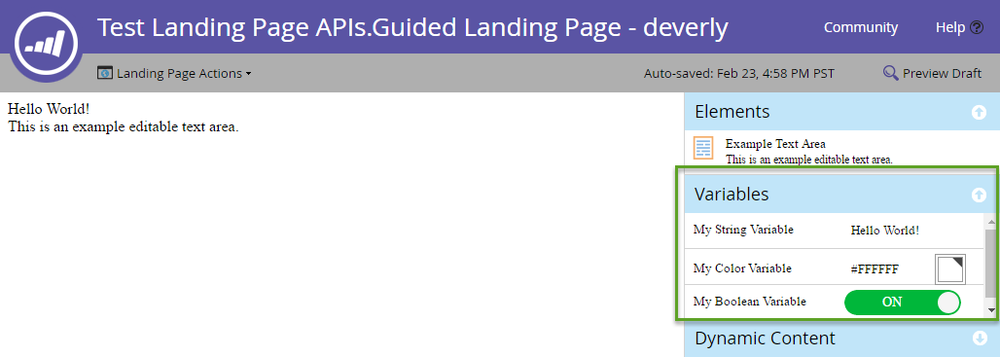

# Páginas de destino

[Referencia de extremo de página de aterrizaje](https://developer.adobe.com/marketo-apis/api/asset#tag/Landing-Pages)

Las páginas de aterrizaje son páginas web alojadas por Marketo. Utilice las API de REST de páginas de aterrizaje para consultar y administrar sus metadatos, contenido, ciclo vital y vista previa.

## Consulta

Páginas de aterrizaje de consulta [por nombre](https://developer.adobe.com/marketo-apis/api/asset#tag/Landing-Pages/operation/getLandingPageByNameUsingGET), [por identificador](https://developer.adobe.com/marketo-apis/api/asset#tag/Landing-Pages/operation/getLandingPageByIdUsingGET) o por [exploración](https://developer.adobe.com/marketo-apis/api/asset#tag/Landing-Pages/operation/browseLandingPagesUsingGET). Estas consultas solo devuelven metadatos. Consulte las secciones de contenido de una página de aterrizaje por separado por ID de página.

La consulta del contenido de la página de aterrizaje devuelve sus secciones de contenido disponibles. Debe aparecer una sección en esta lista antes de que pueda actualizarla.

```http
GET /rest/asset/v1/landingPage/{id}/content.json
```

```json
{
    "success": true,
    "warnings": [],
    "errors": [],
    "requestId": "6307#154ea1689d7",
    "result": [
        {
            "id": "67",
            "type": "Form",
            "index": 1,
            "content": {
                "content": "189",
                "contentType": "Form",
                "contentUrl": "https://app-devlocal1.marketo.com/#FO189A1ZN13LA1"
            },
            "formattingOptions": {
                "zIndex": 15,
                "left": "359px",
                "top": "122px"
            }
        }
    ]
}
```

Las páginas de aterrizaje guiadas incluyen secciones definidas por su plantilla. Las páginas de forma libre no incluyen secciones predefinidas, por lo que debe añadir su contenido antes de editarlo.

El formato del atributo `content` depende del atributo `type` y de si el campo es estático o dinámico.

## Crear y actualizar

[Crear una página de aterrizaje](https://developer.adobe.com/marketo-apis/api/asset#tag/Landing-Pages/operation/createLandingPageUsingPOST) a partir de una plantilla. El nombre de página, el ID de plantilla y la carpeta de destino son obligatorios. Consulte la referencia del extremo para ver metadatos opcionales.

Los extremos de [contenido de página de aterrizaje](https://developer.adobe.com/marketo-apis/api/asset#tag/Landing-Page-Content) admiten estos tipos de contenido: `richText`, `HTML`, `Form`, `Image`, `Rectangle` y `Snippet`.

```http
POST rest/asset/v1/landingPages.json
```

```text
Content-Type: application/x-www-form-urlencoded
```

```text
name=createLandingPage&folder={"type": "Folder", "id": 11}&template=1&description=this is a test&workspace=default&title=test create&keywords=awesome&formPrefill=false
```

```json
{
    "success": true,
    "warnings": [],
    "errors": [],
    "requestId": "7a39#154cf7922c6",
    "result": [
        {
            "id": 27,
            "name": "createLandingPage",
            "description": "this is a test",
            "createdAt": "2016-05-20T18:41:43Z+0000",
            "updatedAt": "2016-05-20T18:41:43Z+0000",
            "folder": {
                "type": "Folder",
                "value": 11,
                "folderName": "Landing Pages"
            },
            "workspace": "Default",
            "status": "draft",
            "template": 1,
            "title": "test create",
            "keywords": "awesome",
            "robots": "index, nofollow",
            "formPrefill": false,
            "mobileEnabled": false,
            "URL": "https://app-devlocal1.marketo.com/lp/622-LME-718/createLandingPage.html",
            "computedUrl": "https://app-devlocal1.marketo.com/#LP27B2"
        }
    ]
}
```

Los metadatos de la página de aterrizaje se pueden actualizar con [Actualizar extremo de metadatos de la página de aterrizaje](https://developer.adobe.com/marketo-apis/api/asset#tag/Landing-Pages/operation/updateLandingPageUsingPOST).

## Aprobación

Las páginas de aterrizaje utilizan el borrador estándar y el modelo aprobado. Las actualizaciones se aplican al borrador y se activan solo después de la aprobación.

## Eliminar

Antes de eliminar una página de aterrizaje, asegúrese de que no esté aprobada y de que ningún otro recurso de Marketo haga referencia a ella. Eliminar páginas individualmente con el punto de conexión [Eliminar página de aterrizaje](https://developer.adobe.com/marketo-apis/api/asset#tag/Landing-Pages/operation/deleteLandingPageByIdUsingPOST). No puede utilizar esta API para eliminar páginas con botones sociales incrustados.

## Clonar

Clonar una página de aterrizaje con una petición POST `application/x-www-url-formencoded`.

El parámetro de ruta `id` especifica la página de aterrizaje de origen.

El parámetro `name` especifica el nuevo nombre de página de aterrizaje.

El parámetro `folder` especifica la carpeta principal. Páselo como un objeto JSON incrustado que contiene `id` y `type`.

El parámetro `template` especifica el identificador de plantilla de la página de aterrizaje de origen.

El parámetro opcional `description` describe la nueva página de aterrizaje.

```http
POST /rest/asset/v1/landingPage/{id}/clone.json
```

```text
Content-Type: application/x-www-form-urlencoded
```

```text
name=MyNewLandingPage&folder={"type":"Program","id":1119}&template=57
```

```json
{
    "success": true,
    "errors": [],
    "requestId": "1078d#1683e4881c6",
    "warnings": [],
    "result": [
        {
            "id": 3291,
            "name": "MyNewLandingPage",
            "createdAt": "2019-01-11T18:59:25Z+0000",
            "updatedAt": "2019-01-11T18:59:25Z+0000",
            "folder": {
                "type": "Program",
                "value": 1119,
                "folderName": "DefaultProgramWithGuidedLP"
            },
            "workspace": "Default",
            "status": "draft",
            "template": 57,
            "robots": "index, nofollow",
            "formPrefill": false,
            "mobileEnabled": false,
            "URL": "http://na-abm.marketo.com/lp/284-RPR-133/DefaultProgramWithGuidedLPPerkutoTestLP-Clone-1.html",
            "computedUrl": "https://app-abm.marketo.com/#LP3291A1LA1"
        }
    ]
}
```

## Sección Administrar contenido

Las secciones de contenido se ordenan por su propiedad `index` y se muestran según las reglas CSS del cliente. Use los extremos [Agregar](https://developer.adobe.com/marketo-apis/api/asset#tag/Landing-Page-Content/operation/addLandingPageContentUsingPOST), [Actualizar](https://developer.adobe.com/marketo-apis/api/asset#tag/Landing-Page-Content/operation/updateLandingPageContentUsingPOST) y [Eliminar](https://developer.adobe.com/marketo-apis/api/asset#tag/Landing-Page-Content/operation/removeLandingPageContentUsingPOST) para administrar las secciones. Use [Obtener contenido de la página de aterrizaje](https://developer.adobe.com/marketo-apis/api/asset#tag/Landing-Page-Content/operation/getLandingPageContentUsingGET) para consultarlos.

Cada sección tiene `type` y `value` parámetros. `type` determina el `value` esperado. Pase datos a estos extremos como POST `x-www-form-urlencoded`, no como JSON.

**Tipos de sección**

| Tipo | Valor |
| --- | --- |
| DynamicContent | El ID de la segmentación. |
| Formulario | El ID del formulario. |
| HTML | Contenido de HTML de texto. |
| Imagen | El ID del recurso de imagen. |
| Rectángulo | Vacío. |
| Texto enriquecido | Contenido de HTML de texto.  Solo puede contener elementos de texto enriquecido. |
| Fragmento | El ID del fragmento. |
| SocialButton | El ID del botón social. |
| Vídeo | El ID del vídeo. |

Para las páginas de forma libre, agregue cada sección de contenido requerida. Marketo los incrusta en el elemento `div` con el identificador `mktoContent`.

Las páginas guiadas pueden incluir elementos predefinidos devueltos por [Obtener contenido de la página de aterrizaje](https://developer.adobe.com/marketo-apis/api/asset#tag/Landing-Page-Content/operation/getLandingPageContentUsingGET). Use los extremos correspondientes para agregar elementos o [actualizar su contenido](https://developer.adobe.com/marketo-apis/api/asset#tag/Landing-Page-Content/operation/updateLandingPageContentUsingPOST).

### Contenido dinámico

Para hacer que una sección sea dinámica, primero asegúrese de que aparezca en la lista de contenido de la página de aterrizaje. A continuación, use [Actualizar sección de contenido de página de aterrizaje](https://developer.adobe.com/marketo-apis/api/asset#tag/Landing-Page-Content/operation/updateLandingPageContentUsingPOST) para establecer su tipo en `DynamicContent`.

Marketo crea secciones dinámicas subyacentes que heredan el tipo base y el contenido del elemento convertido.

```http
GET /rest/asset/v1/landingPage/{id}/dynamicContent/RVMtNDg=.json
```

```json
{
  "success": true,
  "warnings": [],
  "errors": [],
  "requestId": "46e#1560fa169d9",
  "result": [
    {
      "createdAt": "2016-07-21",
      "updatedAt": "2016-07-21",
      "segmentation": 1007,
      "segments": [
        {
          "segmentId": 1018,
          "segmentName": "Default",
          "type": "RichText",
          "content": "\n\t\t\t\t\t\t\tAlice was beginning to get very tired of sitting by her sister on the bank, and having nothing to do: once or twice she had peeped into the book her sister was reading, but it had no pictures or conversations in it.\n\t\t\t\t\t\t"
        },
        {
          "segmentId": 1017,
          "segmentName": "New Segment",
          "type": "RichText",
          "content": "\n\t\t\t\t\t\t\tAlice was beginning to get very tired of sitting by her sister on the bank, and having nothing to do: once or twice she had peeped into the book her sister was reading, but it had no pictures or conversations in it.\n\t\t\t\t\t\t"
        }
      ]
    }
  ]
}
```

[La actualización del contenido](https://developer.adobe.com/marketo-apis/api/asset#tag/Landing-Page-Content/operation/updateLandingPageDynamicContentUsingPOST) para cada segmento individual se realiza según el ID del segmento.

```http
POST /rest/asset/v1/landingPage/{id}/dynamicContent/{dynamicContentId}.json
```

```text
Content-Type: application/x-www-form-urlencoded
```

```text
segment=New Segment&value=New Content
```

```json
 {
  "success": true,
  "warnings": [],
  "errors": [],
  "requestId": "7516#14e08fe7cbbc",
  "result": [
    {
      "id": 1012
    }
  ]
}
```

## Variables

Las páginas de aterrizaje guiadas admiten variables editables que contienen valores de elemento. Modifique las variables en el editor de la página de aterrizaje:



Las variables son metaetiquetas en el elemento `<head>` de una plantilla de página de aterrizaje guiada. Los tipos compatibles son Cadena, Color y Booleano. El ejemplo siguiente define una variable de cada tipo:

```html
<head>
  <meta charset="utf-8">
  <meta class="mktoString" mktoName="My String Variable" id="stringVar" default="Hello World!">
  <meta class="mktoColor" mktoName="My Color Variable" id="colorVar" default="#ffffff">
  <meta class="mktoBoolean" mktoName="My Boolean Variable" id="boolVar" default="true">
</head>
```

Para obtener más información, consulte la sección &quot;Variable editable&quot; en la documentación de [Crear una plantilla de página de aterrizaje guiada](https://experienceleague.adobe.com/es/docs/marketo/using/product-docs/demand-generation/landing-pages/landing-page-templates/create-a-guided-landing-page-template).

### Consulta

Recupere variables para una página de aterrizaje guiada pasando el ID de la página de aterrizaje al punto de conexión Obtener variables de página de aterrizaje.

```http
GET /rest/asset/v1/landingPage/{id}/variables.json
```

```json
{
    "success": true,
    "warnings": [],
    "errors": [],
    "requestId": "10843#15a6d7e5fa1",
    "result": [
        {
            "id": "stringVar",
            "value": "Hello World!",
            "type": "string"
        },
        {
            "id": "colorVar",
            "value": "#FFFFFF",
            "type": "color"
        },
        {
            "id": "boolVar",
            "value": "true",
            "type": "boolean"
        }
    ]
}
```

Esta página de aterrizaje guiada contiene tres variables: `stringVar`, `colorVar` y `boolVar`.

### Actualización

Actualice una variable para una página de aterrizaje guiada pasando el ID de página de aterrizaje, el ID de variable y el valor de variable al punto de conexión Actualizar variables de página de aterrizaje.

```http
POST /rest/asset/v1/landingPage/{id}/variable/{variableId}.json?value={newValue}
```

```json
{
    "success": true,
    "warnings": [],
    "errors": [],
    "requestId": "2b07#15a6db77da3",
    "result": [
        {
            "id": "stringVar",
            "value": "Hello Brave New World!",
            "type": "String"
        }
    ]
}
```

## Previsualizar página de aterrizaje

Use [Obtener contenido completo de la página de aterrizaje](https://developer.adobe.com/marketo-apis/api/asset#tag/Landing-Pages/operation/getLandingPageFullContentUsingGET) para recuperar una vista previa procesada por el explorador. Se requiere el parámetro de ruta de acceso de la página de aterrizaje `id`. El extremo también acepta dos parámetros de consulta opcionales:

- `segmentation`: matriz de objetos JSON que contiene `segmentationId` y `segmentId`. La vista previa representa un posible cliente que coincide con esos segmentos.
- `leadId`: un identificador de posible cliente entero. La vista previa representa el posible cliente especificado.

```http
GET /rest/asset/v1/landingPage/{id}/fullContent.json?leadId=1001&segmentation=[{"segmentationId":1030,"segmentId":1103}]
```

```json
{
  "success": true,
  "errors": [],
  "requestId": "119ab#17692849f1e",
  "warnings": [],
  "result": [
    {
      "id": 1023,
      "content": "<!DOCTYPE html>\n<html>\n <head>\n <meta charset=\"utf-8\">\n \n \n <meta name=\"robots\" content=\"index, nofollow\">\n <title></title>\n <style>\n body {background:#FFFFFF} \n #myConditionalDisplayArea {\n display: true;\n }\n </style>\n <link rel=\"shortcut icon\" href=\"/favicon.ico\" type=\"image/x-icon\" >\n<link rel=\"icon\" href=\"/favicon.ico\" type=\"image/x-icon\" >\n\n\n<style>.mktoGen.mktoImg {display:inline-block; line-height:0;}</style>\n </head>\n <body id=\"bodyId\">\n \n Hello Brave New World!\n <div class=\"mktoText\" id=\"exampleText\"><div>This is an example editable text area.</div>\n<div>Lead Full Name = Hanna Crawford</div>\n<div><br /></div>\n <script type=\"text/javascript\" src=\"//munchkin.marketo.net//munchkin.js\"></script><script>Munchkin.init('123-ABC-456', {customName: 'Test-Landing-Page-APIs_Guided-Landing-Page---deverly', PURL_VISIT_TOKEN, wsInfo: 'j1RR'});</script>\n<div id=\"mktoClickBlockingDiv\"></div>\n </body>\n</html>\n"
    }
  ]
}
```
