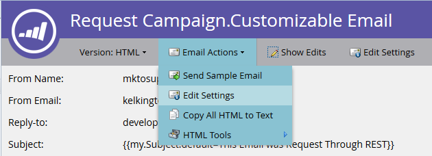
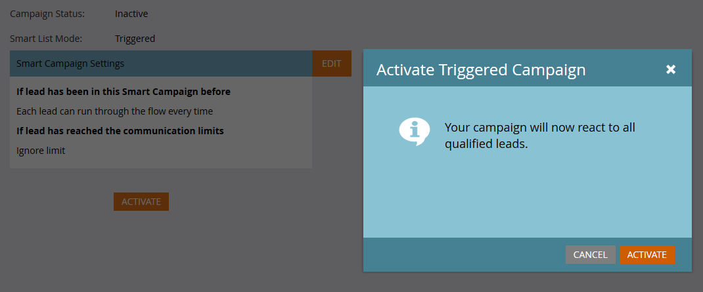

# Correo electrónico transaccional

Un caso de uso común para la API de Marketo es almacenar en déclencheur el envío de correos electrónicos transaccionales a registros específicos mediante [Solicitar campaña](https://developer.adobe.com/marketo-apis/api/mapi/#tag/Campaigns/operation/triggerCampaignUsingPOST) Llamada de API. Hay algunos requisitos de configuración en Marketo para ejecutar la llamada necesaria con la API de REST de Marketo.

- El destinatario debe tener un registro en Marketo
- Debe haber un correo electrónico transaccional creado y aprobado en la instancia de Marketo.
- Debe haber una campaña de déclencheur activa con la etiqueta &quot;Se solicita la campaña, 1. Fuente: &quot;API del servicio web&quot;, que se configura para enviar el correo electrónico

Primero [crear y aprobar el correo electrónico](https://experienceleague.adobe.com/docs/marketo/using/home.html?lang=es). Si el correo electrónico es verdaderamente transaccional, probablemente deba configurarlo como operativo, pero asegúrese de que cumpla los requisitos legales para ser operativo. Se configura desde con la pantalla Editar en Acciones de correo electrónico > Configuración de correo electrónico:




Apruébelo y estamos listos para crear nuestra campaña:


Si es nuevo en la creación de campañas, consulte la [Creación de una nueva campaña inteligente](https://experienceleague.adobe.com/docs/marketo/using/product-docs/core-marketo-concepts/smart-campaigns/creating-a-smart-campaign/create-a-new-smart-campaign.html) artículo. Una vez creada la campaña, debemos seguir estos pasos. Configure la lista inteligente con el déclencheur Campaign is Requested:


Ahora debemos configurar el flujo para que apunte al paso Enviar correo electrónico a nuestro correo electrónico:


Antes de la activación, debe decidir algunas configuraciones en la pestaña Programación. Si este correo electrónico en particular solo debe enviarse una vez a un registro determinado, deje la configuración de calificación tal cual. Sin embargo, si es necesario que reciban el correo electrónico varias veces, debe ajustarlo a cada vez o a una de las cadencias disponibles:

Ahora estamos listos para activar:



## Envío de llamadas de API

**Nota:** En los ejemplos de Java siguientes, se utiliza la variable [paquete minimal-json](https://github.com/ralfstx/minimal-json) para gestionar representaciones JSON en nuestro código.

La primera parte del envío de un correo electrónico transaccional a través de la API es garantizar que exista un registro con la dirección de correo electrónico correspondiente en la instancia de Marketo y que tengamos acceso a su ID de posible cliente. A efectos de esta publicación, suponemos que las direcciones de correo electrónico ya están en Marketo y que solo debemos recuperar el ID del registro. Para ello, utilizamos el [Obtener posibles clientes por tipo de filtro](https://developer.adobe.com/marketo-apis/api/mapi/#tag/Leads/operation/getLeadsByFilterUsingGET) llamada. Veamos nuestro método Main para que solicite la campaña:

```java
package dev.marketo.blog_request_campaign;

import com.eclipsesource.json.JsonArray;

public class App 
{
    public static void main( String[] args )
    {
        //Create an instance of Auth so that we can authenticate with our Marketo instance
        Leads leadsRequest = new Leads(auth).setFilterType("email").addFilterValue("requestCampaign.test@marketo.com");

        //Create and parameterize an instance of Leads
        //Set your email filterValue appropriately
        Leads leadsRequest = new Leads(auth).setFilterType("email").addFilterValue("test.requestCamapign@example.com");

        //Get the inner results array of the response
        JsonArray leadsResult = leadsRequest.getData().get("result").asArray();

        //Get the id of the record indexed at 0
        int lead = leadsResult.get(0).asObject().get("id").asInt();

        //Set the ID of your campaign from Marketo
        int campaignId = 0;
        RequestCampaign rc = new RequestCampaign(auth, campaignId).addLead(lead);

        //Send the request to Marketo
        rc.postData();
    }
}
```

Para obtener estos resultados de la respuesta JsonObject de leadRequest, debemos escribir algún código . Para recuperar el primer resultado en Array, se debe extraer Array del objeto JsonObject y indexar el objeto en 0:

```java
JsonArray leadsResult = leadsRequest.getData().get("result").asArray();
int leadId = leadsResult.get(0).asObject().get("id").asInt();
```

A partir de aquí, todo lo que debemos hacer es solicitar la llamada de campaña. Para ello, los parámetros requeridos son ID en la dirección URL de la solicitud y una matriz de objetos JSON que contenga un miembro, &quot;id&quot;. Veamos el código para esto:.

```java
package dev.marketo.blog_request_campaign;
import java.io.IOException;
import java.io.InputStream;
import java.io.InputStreamReader;
import java.io.OutputStreamWriter;
import java.io.Reader;
import java.net.MalformedURLException;
import java.net.URL;
import java.util.ArrayList;
import javax.net.ssl.HttpsURLConnection;
import com.eclipsesource.json.JsonArray;
import com.eclipsesource.json.JsonObject;

public class RequestCampaign {
    private String endpoint;
    private Auth auth;
    public ArrayList leads = new ArrayList();
    public ArrayList tokens = new ArrayList();
    
    public RequestCampaign(Auth auth, int campaignId) {
        this.auth = auth;
        this.endpoint = this.auth.marketoInstance + "/rest/v1/campaigns/" + campaignId + "/trigger.json";
    }
    public RequestCampaign setLeads(ArrayList leads) {
        this.leads = leads;
        return this;
    }
    public RequestCampaign addLead(int lead){
        leads.add(lead);
        return this;
    }
    public RequestCampaign setTokens(ArrayList tokens) {
        this.tokens = tokens;
        return this;
    }
    public RequestCampaign addToken(String tokenKey, String val){
        JsonObject jo = new JsonObject().add("name", tokenKey);
        jo.add("value", val);
        tokens.add(jo);
        return this;
    }
    public JsonObject postData(){
        JsonObject result = null;
        try {
            JsonObject requestBody = buildRequest(); //builds the Json Request Body
            String s = endpoint + "?access_token=" + auth.getToken(); //takes the endpoint URL and appends the access_token parameter to authenticate
            System.out.println("Executing RequestCampaign call\n" + "Endpoint: " + s + "\nRequest Body:\n"  + requestBody);
            URL url = new URL(s); 
            HttpsURLConnection urlConn = (HttpsURLConnection) url.openConnection(); //Return a URL connection and cast to HttpsURLConnection
            urlConn.setRequestMethod("POST");
            urlConn.setRequestProperty("Content-type", "application/json");
            urlConn.setRequestProperty("accept", "text/json");
            urlConn.setDoOutput(true);
            OutputStreamWriter wr = new OutputStreamWriter(urlConn.getOutputStream());
            wr.write(requestBody.toString());
            wr.flush();
            InputStream inStream = urlConn.getInputStream(); //get the inputStream from the URL connection
            Reader reader = new InputStreamReader(inStream);
            result = JsonObject.readFrom(reader); //Read from the stream into a JsonObject
            System.out.println("Result:\n" + result);
        } catch (MalformedURLException e) {
            e.printStackTrace();
        } catch (IOException e) {
            e.printStackTrace();
        }
        return result;
    }
    
    private JsonObject buildRequest(){
        JsonObject requestBody = new JsonObject(); //Create a new JsonObject for the Request Body
        JsonObject input = new JsonObject();
        JsonArray leadsArray = new JsonArray();
        for (int lead : leads) {
            JsonObject jo = new JsonObject().add("id", lead);
            leadsArray.add(jo);
        }
        input.add("leads", leadsArray);
        JsonArray tokensArray = new JsonArray();
        for (JsonObject jo : tokens) {
            tokensArray.add(jo);
        }
        input.add("tokens", tokensArray);
        requestBody.add("input", input);
        return requestBody;
    }

}
```

Esta clase tiene un constructor que toma un Auth y el ID de la campaña. Los posibles clientes se agregan al objeto pasando un `ArrayList<Integer>` que contenga los identificadores de los registros que se van a establecerLeads o que utilice addLead, que toma un entero y lo anexa a la ArrayList existente en la propiedad lead. Para almacenar en déclencheur la llamada de API para pasar los registros de posibles clientes a la campaña, se debe llamar a postData, que devuelve un JsonObject que contiene los datos de respuesta de la solicitud. Cuando se llama a la campaña de solicitud, cada posible cliente pasado a la llamada se procesa mediante la campaña de déclencheur de destinatario en Marketo y se envía el correo electrónico que se creó anteriormente. ¡Enhorabuena! Ha activado un correo electrónico mediante la API de REST de Marketo. Esté atento a la Parte 2, donde analizamos la personalización dinámica del contenido de un correo electrónico a través de la Campaña de solicitud.

### Creación del correo electrónico

Para personalizar el contenido, primero debemos configurar una [programa](https://experienceleague.adobe.com/docs/marketo/using/product-docs/core-marketo-concepts/programs/creating-programs/create-a-program.html) y un [email](https://experienceleague.adobe.com/docs/marketo/using/home.html?lang=es) en Marketo. Para generar nuestro contenido personalizado, debemos crear tokens dentro del programa y luego colocarlos en el correo electrónico que vamos a enviar. Para simplificar, en este ejemplo utilizamos un solo token, pero puede reemplazar cualquier número de tokens en un mensaje de correo electrónico, en el formulario de correo electrónico, en el nombre del remitente, en la respuesta a o en cualquier parte del contenido del correo electrónico. Así que vamos a crear un texto enriquecido token para el reemplazo y llamarlo &quot;bodyReplacement&quot;. El texto enriquecido nos permite reemplazar cualquier contenido del token con un HTML arbitrario que queramos introducir.


Los tokens no se pueden guardar cuando están vacíos, así que adelante e inserte aquí algún texto de marcador de posición. Ahora debemos insertar nuestro token en el correo electrónico:


Ahora se podrá acceder a este token para su reemplazo mediante una llamada a Request Campaign. Este token puede ser tan simple como una sola línea de texto que debe reemplazarse por correo electrónico, o puede incluir casi todo el diseño del correo electrónico.

### El código

```java
package dev.marketo.blog_request_campaign;

import com.eclipsesource.json.JsonArray;

public class App 
{
    public static void main( String[] args )
    {
        //Create an instance of Auth so that we can authenticate with our Marketo instance
        Auth auth = new Auth("Client ID - CHANGE ME", "Client Secret - CHANGE ME", "Host - CHANGE ME");
        
        //Create and parameterize an instance of Leads
        Leads leadsRequest = new Leads(auth).setFilterType("email").addFilterValue("requestCampaign.test@marketo.com");
        
        //get the inner results array of the response
        JsonArray leadsResult = leadsRequest.getData().get("result").asArray();
        
        //get the id of the record indexed at 0
        int lead = leadsResult.get(0).asObject().get("id").asInt();
        
        //Set the ID of our campaign from Marketo
        int campaignId = 1578;
        RequestCampaign rc = new RequestCampaign(auth, campaignId).addLead(lead);

        //Create the content of the token here, and add it to the request
        String bodyReplacement = "<div class=\"replacedContent\"><p>This content has been replaced</p></div>";
        rc.addToken("{{my.bodyReplacement}}", bodyReplacement);
        rc.postData();
    }
}
```

Si el código le resulta familiar, es porque solo tiene dos líneas adicionales del método principal anterior. Esta vez vamos a crear el contenido de nuestro token en la variable bodyReplacement y, a continuación, utilizar el método addToken para agregarlo a la solicitud. addToken toma una clave y un valor y, a continuación, crea una representación de JsonObject y la añade a la matriz de tokens interna. A continuación, esto se serializa durante el método postData y crea un cuerpo con este aspecto:

```json
{
    "input":
    {
        "leads": [
            {
                "id": 1
            }
        ],
        "tokens": [
            {
                "name": "{{my.bodyReplacement}}",
                "value": "<div class=\"replacedContent\"><p>This content has been replaced</p></div>"
            }
        ]
    }
}
```

En conjunto, la salida de la consola tiene este aspecto:

```bash
Token is empty or expired. Trying new authentication
Trying to authenticate with ...
Got Authentication Response: {"access_token":"19d51b9a-ff60-4222-bbd5-be8b206f1d40:st","token_type":"bearer","expires_in":3565,"scope":"apiuser@mktosupport.com"}
Executing RequestCampaign call
Endpoint: .../rest/v1/campaigns/1578/trigger.json?access_token=19d51b9a-ff60-4222-bbd5-be8b206f1d40:st
Request Body:
{"input":{"leads":[{"id":1}],"tokens":[{"name":"{{my.bodyReplacement}}","value":"<div class=\"replacedContent\"><p>This content has been replaced</p></div>"}]}}
Result:
{"requestId":"1e8d#14eadc5143d","result":[{"id":1578}],"success":true}
```

## Ajuste

Este método se puede ampliar de muchas maneras, cambiando el contenido de los correos electrónicos en secciones de diseño individuales o fuera de los correos electrónicos, lo que permite pasar valores personalizados a tareas o momentos interesantes. Se puede personalizar utilizando este método en cualquier lugar donde se pueda utilizar un token desde un programa. Una funcionalidad similar también está disponible con el [Programar campaña](https://developer.adobe.com/marketo-apis/api/mapi/#tag/Campaigns/operation/scheduleCampaignUsingPOST) llamada a, que le permite procesar tokens en una campaña por lotes completa. No se pueden personalizar por posible cliente, pero son útiles para personalizar el contenido en un amplio conjunto de posibles clientes.
