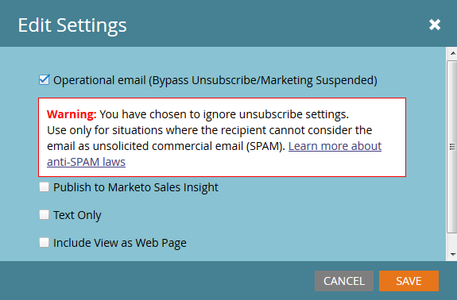
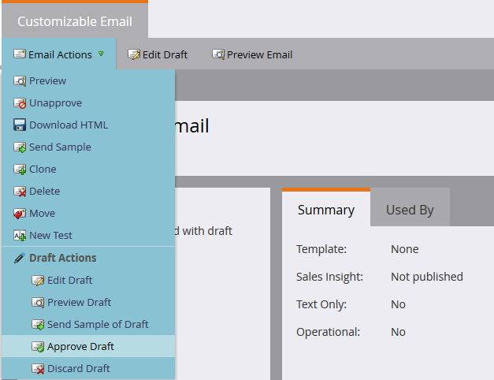
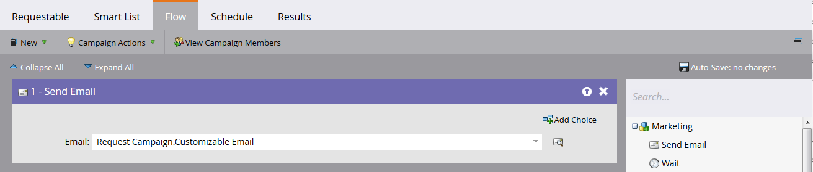
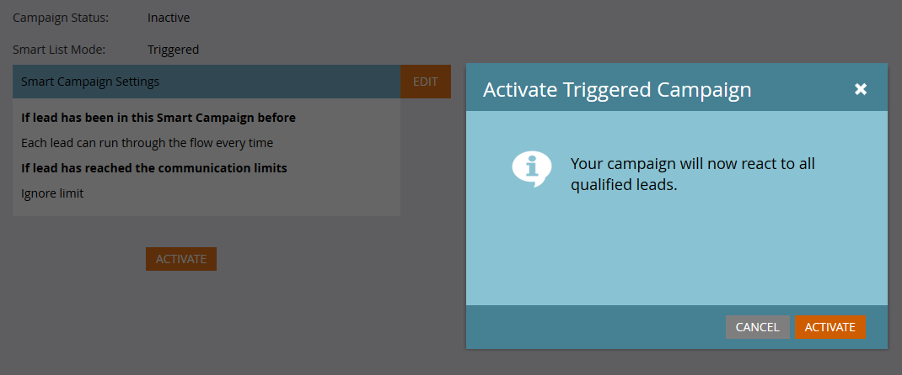
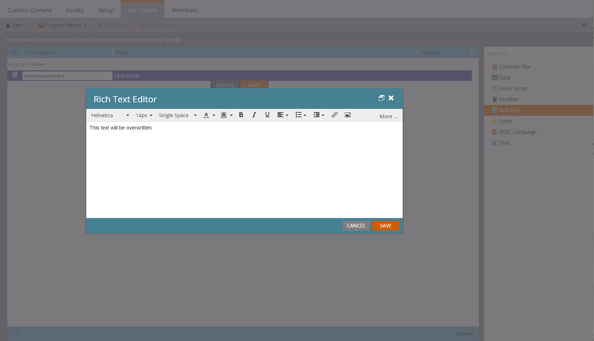

# Correo electrónico transaccional

Utilice la API [Solicitar campaña](https://developer.adobe.com/marketo-apis/api/mapi#tag/Campaigns/operation/triggerCampaignUsingPOST) para enviar correos electrónicos transaccionales a registros específicos de Marketo. Configure la campaña de correo electrónico y déclencheur antes de realizar la solicitud.

- Asegúrese de que el destinatario tenga un registro Marketo.
- Cree y apruebe un correo electrónico transaccional en la instancia de Marketo.
- Active una campaña de déclencheur que utilice &quot;Se solicita la campaña, 1. Source: &quot;API de servicio web&quot; y envía el correo electrónico.

Primero [cree y apruebe el correo electrónico](https://experienceleague.adobe.com/docs/marketo/using/home.html?lang=es). Si el correo electrónico cumple los requisitos legales para ser operativo, configúrelo como operativo en Acciones de correo electrónico > Configuración de correo electrónico:




Apruebe el correo electrónico antes de crear la campaña:



Si es necesario, consulte [Crear una nueva campaña inteligente](https://experienceleague.adobe.com/docs/marketo/using/product-docs/core-marketo-concepts/smart-campaigns/creating-a-smart-campaign/create-a-new-smart-campaign.html?lang=es). Configure la lista inteligente de la campaña con el déclencheur Campaign is Requested:


Configure un paso de flujo Enviar correo electrónico que haga referencia al correo electrónico transaccional:



Antes de la activación, configure las opciones de calificación en la pestaña Programación. Mantenga la configuración predeterminada si cada registro debe recibir el correo electrónico solo una vez. De lo contrario, permita que los destinatarios se clasifiquen cada vez o en una cadencia disponible.

Active la campaña:



## Envío de llamadas de API

Los ejemplos de Java utilizan el [paquete minimal-json](https://github.com/ralfstx/minimal-json) para administrar las representaciones JSON.

Antes de enviar el correo electrónico, confirme que existe un registro de Marketo para la dirección de correo electrónico y recupere su ID de posible cliente. En este ejemplo se supone que la dirección de correo electrónico ya existe.

Use [Obtener posibles clientes por tipo de filtro](https://developer.adobe.com/marketo-apis/api/mapi#tag/Leads/operation/getLeadsByFilterUsingGET) para recuperar el ID. A continuación, el siguiente método principal solicita la campaña:

```java
package dev.marketo.blog_request_campaign;

import com.eclipsesource.json.JsonArray;

public class App
{
    public static void main( String[] args )
    {
        //Create an instance of Auth so that we can authenticate with our Marketo instance
        Leads leadsRequest = new Leads(auth).setFilterType("email").addFilterValue("requestCampaign.test@marketo.com");

        //Create and parameterize an instance of Leads
        //Set your email filterValue appropriately
        Leads leadsRequest = new Leads(auth).setFilterType("email").addFilterValue("test.requestCamapign@example.com");

        //Get the inner results array of the response
        JsonArray leadsResult = leadsRequest.getData().get("result").asArray();

        //Get the id of the record indexed at 0
        int lead = leadsResult.get(0).asObject().get("id").asInt();

        //Set the ID of your campaign from Marketo
        int campaignId = 0;
        RequestCampaign rc = new RequestCampaign(auth, campaignId).addLead(lead);

        //Send the request to Marketo
        rc.postData();
    }
}
```

Extraiga la matriz de resultados de la respuesta `JsonObject` y recupere el objeto en el índice 0:

```java
JsonArray leadsResult = leadsRequest.getData().get("result").asArray();
int leadId = leadsResult.get(0).asObject().get("id").asInt();
```

Campaña de solicitud de llamada con el ID de campaña en la dirección URL de la solicitud. El cuerpo de la solicitud contiene una matriz de objetos JSON con un miembro `id`:

```java
package dev.marketo.blog_request_campaign;
import java.io.IOException;
import java.io.InputStream;
import java.io.InputStreamReader;
import java.io.OutputStreamWriter;
import java.io.Reader;
import java.net.MalformedURLException;
import java.net.URL;
import java.util.ArrayList;
import javax.net.ssl.HttpsURLConnection;
import com.eclipsesource.json.JsonArray;
import com.eclipsesource.json.JsonObject;

public class RequestCampaign {
    private String endpoint;
    private Auth auth;
    public ArrayList leads = new ArrayList();
    public ArrayList tokens = new ArrayList();

    public RequestCampaign(Auth auth, int campaignId) {
        this.auth = auth;
        this.endpoint = this.auth.marketoInstance + "/rest/v1/campaigns/" + campaignId + "/trigger.json";
    }
    public RequestCampaign setLeads(ArrayList leads) {
        this.leads = leads;
        return this;
    }
    public RequestCampaign addLead(int lead){
        leads.add(lead);
        return this;
    }
    public RequestCampaign setTokens(ArrayList tokens) {
        this.tokens = tokens;
        return this;
    }
    public RequestCampaign addToken(String tokenKey, String val){
        JsonObject jo = new JsonObject().add("name", tokenKey);
        jo.add("value", val);
        tokens.add(jo);
        return this;
    }
    public JsonObject postData(){
        JsonObject result = null;
        try {
            JsonObject requestBody = buildRequest(); //builds the Json Request Body
            System.out.println("Executing RequestCampaign call\n" + "Endpoint: " + endpoint + "\nRequest Body:\n"  + requestBody);
            URL url = new URL(endpoint);
            HttpsURLConnection urlConn = (HttpsURLConnection) url.openConnection(); //Return a URL connection and cast to HttpsURLConnection
            urlConn.setRequestMethod("POST");
            urlConn.setRequestProperty("Content-type", "application/json");
            urlConn.setRequestProperty("accept", "text/json");
            urlConn.setDoOutput(true);
            OutputStreamWriter wr = new OutputStreamWriter(urlConn.getOutputStream());
            wr.write(requestBody.toString());
            wr.flush();
            InputStream inStream = urlConn.getInputStream(); //get the inputStream from the URL connection
            Reader reader = new InputStreamReader(inStream);
            result = JsonObject.readFrom(reader); //Read from the stream into a JsonObject
            System.out.println("Result:\n" + result);
        } catch (MalformedURLException e) {
            e.printStackTrace();
        } catch (IOException e) {
            e.printStackTrace();
        }
        return result;
    }

    private JsonObject buildRequest(){
        JsonObject requestBody = new JsonObject(); //Create a new JsonObject for the Request Body
        JsonObject input = new JsonObject();
        JsonArray leadsArray = new JsonArray();
        for (int lead : leads) {
            JsonObject jo = new JsonObject().add("id", lead);
            leadsArray.add(jo);
        }
        input.add("leads", leadsArray);
        JsonArray tokensArray = new JsonArray();
        for (JsonObject jo : tokens) {
            tokensArray.add(jo);
        }
        input.add("tokens", tokensArray);
        requestBody.add("input", input);
        return requestBody;
    }

}
```

Esta clase tiene un constructor que toma un Auth y el ID de la campaña. Los posibles clientes se agregan al objeto pasando un elemento `ArrayList<Integer>` que contiene los identificadores de los registros a setLeads, o utilizando addLead, que toma un entero y lo anexa a la ArrayList existente en la propiedad leads. Para almacenar en déclencheur la llamada de API para pasar los registros de posibles clientes a la campaña, se debe llamar a postData, que devuelve un JsonObject que contiene los datos de respuesta de la solicitud. Cuando se llama a la campaña de solicitud, cada posible cliente pasado a la llamada se procesa mediante la campaña de déclencheur de destinatario en Marketo y se envía el correo electrónico que se creó anteriormente. ¡Enhorabuena! Ha activado un correo electrónico mediante la API de REST de Marketo. Esté atento a la Parte 2, donde analizamos la personalización dinámica del contenido de un correo electrónico a través de la Campaña de solicitud.

### Creación del correo electrónico

Para personalizar nuestro contenido, primero debemos configurar un [programa](https://experienceleague.adobe.com/docs/marketo/using/product-docs/core-marketo-concepts/programs/creating-programs/create-a-program.html?lang=es) y un [correo electrónico](https://experienceleague.adobe.com/docs/marketo/using/home.html?lang=es) en Marketo. Para generar nuestro contenido personalizado, debemos crear tokens dentro del programa y luego colocarlos en el correo electrónico que vamos a enviar. Para simplificar, en este ejemplo utilizamos un solo token, pero puede reemplazar cualquier número de tokens en un mensaje de correo electrónico, en el formulario de correo electrónico, en el nombre del remitente, en la respuesta a o en cualquier parte del contenido del correo electrónico. Así que vamos a crear un texto enriquecido token para el reemplazo y llamarlo &quot;bodyReplacement&quot;. El texto enriquecido nos permite reemplazar cualquier contenido del token con HTML arbitrario que queramos introducir.



Los tokens no se pueden guardar mientras estén vacíos, así que continúe e inserte aquí algún texto de marcador de posición. Ahora debemos insertar nuestro token en el correo electrónico:


Ahora se podrá acceder a este token para su reemplazo mediante una llamada a Request Campaign. Este token puede ser tan simple como una sola línea de texto que debe reemplazarse por correo electrónico, o puede incluir casi todo el diseño del correo electrónico.

### El código

```java
package dev.marketo.blog_request_campaign;

import com.eclipsesource.json.JsonArray;

public class App
{
    public static void main( String[] args )
    {
        //Create an instance of Auth so that we can authenticate with our Marketo instance
        Auth auth = new Auth("Client ID - CHANGE ME", "Client Secret - CHANGE ME", "Host - CHANGE ME");

        //Create and parameterize an instance of Leads
        Leads leadsRequest = new Leads(auth).setFilterType("email").addFilterValue("requestCampaign.test@marketo.com");

        //get the inner results array of the response
        JsonArray leadsResult = leadsRequest.getData().get("result").asArray();

        //get the id of the record indexed at 0
        int lead = leadsResult.get(0).asObject().get("id").asInt();

        //Set the ID of our campaign from Marketo
        int campaignId = 1578;
        RequestCampaign rc = new RequestCampaign(auth, campaignId).addLead(lead);

        //Create the content of the token here, and add it to the request
        String bodyReplacement = "<div class=\"replacedContent\"><p>This content has been replaced</p></div>";
        rc.addToken("{{my.bodyReplacement}}", bodyReplacement);
        rc.postData();
    }
}
```

Si el código le resulta familiar, es porque solo tiene dos líneas adicionales del método principal anterior. Esta vez se crea el contenido de nuestro token en la variable bodyReplacement y, a continuación, se utiliza el método addToken para agregarlo a la solicitud. addToken toma una clave y un valor y, a continuación, crea una representación de JsonObject y la añade a la matriz de tokens interna. A continuación, esto se serializa durante el método postData y crea un cuerpo con este aspecto:

```json
{
    "input":
    {
        "leads": [
            {
                "id": 1
            }
        ],
        "tokens": [
            {
                "name": "{{my.bodyReplacement}}",
                "value": "<div class=\"replacedContent\"><p>This content has been replaced</p></div>"
            }
        ]
    }
}
```

En conjunto, la salida de la consola tiene este aspecto:

```bash
Token is empty or expired. Trying new authentication
Trying to authenticate with ...
Got Authentication Response: {"access_token":"19d51b9a-ff60-4222-bbd5-be8b206f1d40:st","token_type":"bearer","expires_in":3565,"scope":"apiuser@mktosupport.com"}
Executing RequestCampaign call
Endpoint: .../rest/v1/campaigns/1578/trigger.json
Request Body:
{"input":{"leads":[{"id":1}],"tokens":[{"name":"{{my.bodyReplacement}}","value":"<div class=\"replacedContent\"><p>This content has been replaced</p></div>"}]}}
Result:
{"requestId":"1e8d#14eadc5143d","result":[{"id":1578}],"success":true}
```

## Ajuste

Este método se puede ampliar de muchas maneras, cambiando el contenido de los correos electrónicos en secciones de diseño individuales o fuera de los correos electrónicos, lo que permite pasar valores personalizados a tareas o momentos interesantes. Se puede personalizar utilizando este método en cualquier lugar donde se pueda utilizar un token desde un programa. También hay una funcionalidad similar disponible con la llamada [Programar campaña](https://developer.adobe.com/marketo-apis/api/mapi#tag/Campaigns/operation/scheduleCampaignUsingPOST) que le permitirá procesar tokens en toda una campaña por lotes. No se pueden personalizar por posible cliente, pero son útiles para personalizar el contenido en un amplio conjunto de posibles clientes.
