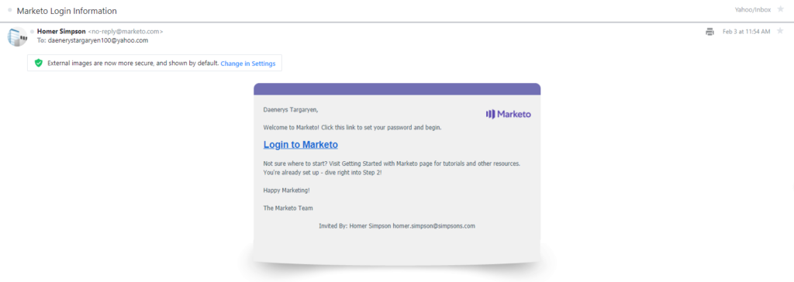

# Gestión de usuarios

[Referencia de extremo de User Management](https://developer.adobe.com/marketo-apis/api/user/)

Marketo proporciona un conjunto de puntos finales de User Management que le permiten realizar operaciones de CRUD en registros de usuarios en Marketo. Los usuarios se crean enviando una invitación a un usuario, que luego establece una contraseña y obtiene acceso a Marketo por primera vez.

A diferencia de otras API de REST de Marketo, al utilizar las API de administración de usuarios:

- Debe utilizar el método de encabezado HTTP para enviar el token de acceso para autenticarse. No se puede pasar el token de acceso como parámetro de cadena de consulta. Encontrará más información sobre la autenticación [aquí](authentication.md).
- Debe seleccionar un permiso de función de dos grupos diferentes al crear la función de usuario para [Servicio personalizado](https://experienceleague.adobe.com/en/docs/marketo/using/product-docs/administration/additional-integrations/create-a-custom-service-for-use-with-rest-api) para la API de REST:
   1. Permiso &quot;Acceder a usuarios&quot; del [Acceso a administrador](https://experienceleague.adobe.com/en/docs/marketo/using/product-docs/administration/users-and-roles/descriptions-of-role-permissions) grupo
   1. &quot;Acceder a la API de administración de usuarios&quot; desde [API de acceso](https://experienceleague.adobe.com/en/docs/marketo/using/product-docs/administration/users-and-roles/descriptions-of-role-permissions) grupo
- Los cuerpos de respuesta no contienen el atributo booleano &quot;success&quot; que indica el éxito o el error de una llamada. En su lugar, debe evaluar el código de estado de respuesta HTTP. Si una llamada se realiza correctamente, se devuelve un código de estado 200. Si falla una llamada, se devuelve un código de estado de nivel distinto de 200 y el cuerpo de la respuesta contiene la matriz de &quot;errores&quot; estándar con un código de error y un mensaje de error descriptivo.
- El formato de las cadenas de fecha y hora es aaaaMMdd&#39;T&#39;HH:mm:s.SS&#39;t&#39;+|-hhmm&quot;. Esto se aplica a los siguientes atributos: createdAt, updatedAt, expiresAt.
- Los extremos de la API de administración de usuarios no tienen el prefijo &quot;/rest&quot; como otros extremos.

## Consulta

La compatibilidad de consultas para la administración de usuarios incluye la capacidad de recuperar todos los usuarios, funciones y espacios de trabajo. Además, puede recuperar un único registro de usuario por ID de usuario o un registro de rol/espacio de trabajo por ID de usuario.

### Usuario por identificador

El [Obtener usuario por identificador](https://developer.adobe.com/marketo-apis/api/user/#tag/User-Management/operation/getUserUsingGET) el punto final toma un solo `userid` parámetro de ruta y devuelve un único registro de usuario para un usuario que ha aceptado su invitación.

```
GET /userservice/management/v1/users/{userid}/user.json
```

```json
{
  "userid": "jamie@houselannister.com",
  "firstName": "Jamie",
  "lastName": "Lannister",
  "emailAddress": "jamie@lannister.com",
  "optedIn": false,
  "failedLogins": 0,
  "failedDeviceCode": 0,
  "isLocked": false,
  "lockedReason": null,
  "id": 0,
  "apiOnly": false,
  "userRoleWorkspaces": [
    {
      "accessRoleId": 1,
      "accessRoleName": "Admin",
      "workspaceId": 0,
      "workspaceName": "AllZones"
    },
    {
      "accessRoleId": 2,
      "accessRoleName":
      "Standard User",
      "workspaceId": 1008,
      "workspaceName": "World"
    }
  ],
  "expiresAt": "2020-12-31T08:00:00.000t+0000",
  "lastLoginAt": "2020-02-05T01:02:23.000t+0000"
}
```

### Usuario invitado por identificador

El [Obtener usuario invitado por identificador](https://developer.adobe.com/marketo-apis/api/user/#tag/User-Management/operation/getInvitedUserUsingGET) el punto final toma un solo `userid` parámetro de ruta y devuelve un único registro de usuario para un usuario &quot;pendiente&quot; (aún no ha aceptado su invitación).

```
GET /userservice/management/v1/users/{userid}/invite.json
```

```json
{
    "id": 25112,
    "firstName": "Jamie",
    "lastName": "Lannister",
    "emailAddress": "jamie@lannister.com",
    "userId": "jamie@lannister.com",
    "subscriptionId": 3381,
    "status": "pending",
    "expiresAt": "20200807T20:49:54.0t+0000",
    "createdAt": "20200731T20:49:54.0t+0000",
    "updatedAt": "20200731T20:49:54.0t+0000"
}
```

### Roles y espacios de trabajo por ID

El [Obtener roles y espacios de trabajo por identificador](https://developer.adobe.com/marketo-apis/api/user/#tag/User-Management/operation/getUserRolesAndWorkspacesUsingGET) el punto final toma un solo `userid` parámetro de ruta y devuelve una lista de registros de espacio de trabajo y función de usuario. La respuesta contiene una matriz con un objeto que contiene la función, el identificador de área de trabajo y el nombre del usuario especificado.

```
GET /userservice/management/v1/users/{userid}/roles.json
```

```json
[
  {
    "accessRoleId": 1,
    "accessRoleName": "Admin",
    "workspaceId": 0,
    "workspaceName": "AllZones"
  },
  {
    "accessRoleId": 2,
    "accessRoleName": "Standard User",
    "workspaceId": 1008,
    "workspaceName": "World"
  }
]
```

### Examinar usuarios

El [Obtener usuarios](https://developer.adobe.com/marketo-apis/api/user/#tag/User-Management/operation/getUsersUsingGET) el extremo devuelve una lista de todos los registros de usuario. El opcional `pageSize` El parámetro es un entero que especifica el número máximo de entradas que se van a devolver. El valor predeterminado es 20. El máximo es 200. El opcional `pageOffset` El parámetro es un entero que especifica por dónde empezar a recuperar entradas. Se puede utilizar con `pageSize`. El valor predeterminado es 0.

```
GET /userservice/management/v1/users/allusers.json
```

```json
[
  {
    "userid": "jamie@lannister.com",
    "firstName": "Jamie",
    "lastName": "Lannister",
    "emailAddress": "jamie@houselannister.com",
    "id": 6785,
    "apiOnly": false
  },
  {
    "userid": "jeoffery@housebaratheon.com",
    "firstName": "Jeoffery",
    "lastName": "Baratheon",
    "emailAddress": "jeoffery@housebaratheon.com",
    "id": 7718,
    "apiOnly": false
  },
  {
    "userid": "rickon@housestark.com",
    "firstName": "Rickon",
    "lastName": "Stark",
    "emailAddress": "rickon@housestark.com",
    "id": 8612,
    "apiOnly": false
  }
]
```

### Examinar funciones

El [Obtener roles](https://developer.adobe.com/marketo-apis/api/user/#tag/User-Management/operation/getRolesUsingGET) el extremo devuelve una lista de todos los registros de funciones.

```
GET /userservice/management/v1/users/roles.json
```

```json
[
    {
        "id": 1,
        "name": "Admin",
        "description": "All permissions",
        "type": "system",
        "hidden": false,
        "onlyAllZones": true,
        "createdAt": "20100327T18:27:42.0t+0000",
        "updatedAt": "20100327T18:27:42.0t+0000"
    },
    {
        "id": 2,
        "name": "Standard User",
        "description": "All permissions except Admin",
        "type": "system",
        "hidden": false,
        "onlyAllZones": false,
        "createdAt": "20100327T18:27:42.0t+0000",
        "updatedAt": "20180423T02:33:29.0t+0000"
    },
    {
        "id": 24,
        "name": "RTP Launcher",
        "description": "Role required for launcher in RTP",
        "type": "system",
        "hidden": false,
        "onlyAllZones": false,
        "createdAt": "20151024T01:45:40.0t+0000",
        "updatedAt": "20171024T23:41:24.0t+0000"
    },
    {
        "id": 25,
        "name": "RTP Editor",
        "description": "Role required for editor in RTP",
        "type": "system",
        "hidden": false,
        "onlyAllZones": false,
        "createdAt": "20151024T01:45:40.0t+0000",
        "updatedAt": "20171024T23:41:24.0t+0000"
    },
    {
        "id": 101,
        "name": "Analytics User",
        "description": "Has access to Analytics",
        "type": "custom",
        "hidden": false,
        "onlyAllZones": false,
        "createdAt": "20100327T18:27:42.0t+0000",
        "updatedAt": "20180423T02:33:29.0t+0000"
    },
    {
        "id": 102,
        "name": "Marketing User",
        "description": "All permissions except Admin",
        "type": "custom",
        "hidden": false,
        "onlyAllZones": false,
        "createdAt": "20100327T18:27:42.0t+0000",
        "updatedAt": "20100327T18:27:42.0t+0000"
    },
    {
        "id": 103,
        "name": "Web Designer",
        "description": "Has access to Design Studio except approval permission",
        "type": "custom",
        "hidden": false,
        "onlyAllZones": false,
        "createdAt": "20100327T18:27:42.0t+0000",
        "updatedAt": "20180423T02:33:29.0t+0000"
    }
]
```

### Examinar espacios de trabajo

El [Obtener espacios de trabajo](https://developer.adobe.com/marketo-apis/api/user/#tag/User-Management/operation/getWorkspacesUsingGET) extremo devuelve una lista de todos los registros de workspace.

```
GET /userservice/management/v1/users/workspaces.json
```

```json
[
  {
    "id": 1,
    "name": "Default",
    "description": "Initial workspace for Marketing Activities, Design Studio, and so on.",
    "globalViz": 0,
    "status": "active",
    "currencyInfo": null,
    "createdAt": "20160910T23:08:05.0t+0000",
    "updatedAt": "20160910T23:08:05.0t+0000"
  },
  {
    "id": 1008,
    "name": "World",
    "description": "",
    "globalViz": 0,
    "status": "active",
    "currencyInfo": null,
    "createdAt": "20181119T21:59:36.0t+0000",
    "updatedAt": "20181119T21:59:36.0t+0000"
  },
  {
    "id": 1009,
    "name": "Reproduction - US English - All Leads",
    "description": "A Workspace for recreating customer-reported problems.",
    "globalViz": 1,
    "status": "active",
    "currencyInfo": null,
    "createdAt": "20190129T23:36:37.0t+0000",
    "updatedAt": "20190129T23:36:37.0t+0000"
  },
  {
    "id": 1010,
    "name": "US",
    "description": "United States - Qualified Leads",
    "globalViz": 0,
    "status": "active",
    "currencyInfo": null,
    "createdAt": "20190322T15:55:40.0t+0000",
    "updatedAt": "20190322T15:55:40.0t+0000"
  }
]
```

## Invitar usuario

Activado [Suscripciones integradas en IMS de Adobe](https://experienceleague.adobe.com/en/docs/marketo/using/product-docs/administration/marketo-with-adobe-identity/adobe-identity-management-overview), este extremo admite la invitación de [Usuarios solo de API](https://experienceleague.adobe.com/en/docs/marketo/using/product-docs/administration/users-and-roles/create-an-api-only-user) solo. Para invitar [usuarios estándar](https://experienceleague.adobe.com/en/docs/marketo/using/product-docs/administration/users-and-roles/managing-marketo-users), use el [API de administración de usuarios de Adobe](https://developer.adobe.com/umapi/) en su lugar.

El [Invitar al usuario](https://developer.adobe.com/marketo-apis/api/user/#tag/User-Management/operation/inviteUserUsingPOST) para enviar una invitación por correo electrónico de &quot;Bienvenido a Marketo&quot; al nuevo usuario. El cuerpo del correo electrónico contiene un vínculo &quot;Iniciar sesión en Marketo&quot; que permite al usuario acceder a Marketo por primera vez. Para aceptar la invitación, el destinatario del correo electrónico hace clic en el vínculo &quot;Iniciar sesión en Marketo&quot;, crea su contraseña y obtiene acceso a Marketo. Hasta que se complete el proceso de aceptación, la invitación está &quot;pendiente&quot; y no se puede editar el registro de usuario. Una invitación pendiente caduca siete días después de enviarse. Encontrará más información sobre la administración de usuarios [aquí](https://experienceleague.adobe.com/en/docs/marketo/using/product-docs/administration/users-and-roles/managing-marketo-users).

Los parámetros se pasan en el cuerpo de la solicitud en formato application/json

Se requieren los siguientes parámetros:  `emailAddress`, `firstName`, `lastName, userRoleWorkspaces`. El `userRoleWorkspaces` parameter es una matriz de objetos que contienen `accessRoleId` y `workspaceId` atributos.

El `userid` El parámetro es un valor de cadena de identificador de usuario único que se utiliza con fines de inicio de sesión del usuario y debe tener el formato de dirección de correo electrónico. Si no se proporciona en la solicitud, el valor de `userid` toma el valor predeterminado proporcionado en `emailAddress` parámetro.

El booleano `apiOnly` parámetro especifica si el usuario es un [Usuario solo de API](https://experienceleague.adobe.com/en/docs/marketo/using/product-docs/administration/users-and-roles/create-an-api-only-user). El `expiresAt` El parámetro especifica cuándo caduca el inicio de sesión del usuario y tiene el formato W3C ISO-8601 (sin milisegundos). Si no se proporciona en la solicitud, el usuario nunca caducará. El `reason` parameter es una cadena que describe el motivo de la invitación del usuario.

El extremo devuelve un valor de &quot;true&quot; si se realiza correctamente; de lo contrario, se devuelve un mensaje de error.

```
POST /userservice/management/v1/users/invite.json
```

```
Content-Type: application/json
```

```json
{
  "emailAddress": "daenerys@housetargaryen.com",
  "firstName": "Daenerys",
  "lastName": "Targaryen",
  "expiresAt": "2020-12-31T23:59:59-05:00",
  "reason": "Keeper of dragons",
  "userRoleWorkspaces": [
    {
      "accessRoleId": 1,
      "workspaceId": 0
    }
  ]
}
```

```
true
```

A continuación se muestra un ejemplo de la invitación por correo electrónico &quot;Bienvenido a Marketo&quot; que se envía al nuevo usuario. La línea de asunto del correo electrónico es &quot;Información de inicio de sesión de Marketo&quot;, el remitente es la dirección de correo electrónico del usuario solo de API asociado a [Servicio personalizado de API de REST](https://experienceleague.adobe.com/en/docs/marketo/using/product-docs/administration/additional-integrations/create-a-custom-service-for-use-with-rest-api)y el destinatario es el especificado mediante los parámetros firstName, lastName y emailAddress.



El usuario acepta la invitación por correo electrónico introduciendo su contraseña dos veces y haciendo clic en el botón &quot;CREAR CONTRASEÑA&quot;. A continuación, se le concede acceso a Marketo por primera vez.

## Actualizar usuario

La compatibilidad de la actualización para usuarios incluye la capacidad de actualizar atributos de usuario o eliminar un usuario. Solo se pueden actualizar los usuarios que hayan aceptado su invitación. Los atributos se pasan como parámetros al cuerpo de la solicitud en formato application/json

### Actualizar atributos de usuario

Activado [Suscripciones integradas en IMS de Adobe](https://experienceleague.adobe.com/en/docs/marketo/using/product-docs/administration/marketo-with-adobe-identity/adobe-identity-management-overview), este punto de conexión admite la actualización de atributos de [Usuarios solo de API](https://experienceleague.adobe.com/en/docs/marketo/using/product-docs/administration/users-and-roles/create-an-api-only-user) solo. Para actualizar los atributos de [usuarios estándar](https://experienceleague.adobe.com/en/docs/marketo/using/product-docs/administration/users-and-roles/managing-marketo-users), use el [API de administración de usuarios de Adobe](https://developer.adobe.com/umapi/) en su lugar.

El [Actualizar atributos de usuario](https://developer.adobe.com/marketo-apis/api/user/#tag/User-Management/operation/updateUserAttributeUsingPOST) el punto final toma un solo `userid` parámetro de ruta y devuelve un único registro de usuario. El cuerpo de la solicitud contiene uno o más atributos de usuario para actualizar: `emailAddress`, `firstName`, `lastName`, `expiresAt`.

```
POST /userservice/management/v1/users/{userid}/update.json
```

```
Content-Type: application/json
```

```json
{
  "firstName": "JAMIE",
  "lastName": "LANISTER",
  "expiresAt": "20211231T08:00:00.000t+0000"
}
```

```json
{
  "userid": "jamie@houselannister.com",
  "firstName": "JAMIE",
  "lastName": "LANISTER",
  "emailAddress": "jamie@houselannister.com",
  "optedIn": false,
  "failedLogins": 0,
  "failedDeviceCode": 0,
  "isLocked": false,
  "lockedReason": null,
  "id": 0,
  "apiOnly": false,
  "userRoleWorkspaces": [
    {
      "accessRoleId": 1,
      "accessRoleName": "Admin",
      "workspaceId": 0,
      "workspaceName": "AllZones"
    },
    {
      "accessRoleId": 2,
      "accessRoleName":
      "Standard User",
      "workspaceId": 1008,
      "workspaceName": "World"
    }
  ],
  "expiresAt": "2021-12-31T08:00:00.000t+0000"
  "lastLoginAt": "2020-02-05T01:02:23.000t+0000"
}
```

#### Eliminar usuario

Activado [Suscripciones integradas en IMS de Adobe](https://experienceleague.adobe.com/en/docs/marketo/using/product-docs/administration/marketo-with-adobe-identity/adobe-identity-management-overview), este punto de conexión admite la eliminación de [Usuarios solo de API](https://experienceleague.adobe.com/en/docs/marketo/using/product-docs/administration/users-and-roles/create-an-api-only-user) solo. Para eliminar [usuarios estándar](https://experienceleague.adobe.com/en/docs/marketo/using/product-docs/administration/users-and-roles/managing-marketo-users), use el [API de administración de usuarios de Adobe](https://developer.adobe.com/umapi/) en su lugar.

El [Eliminar usuario](https://developer.adobe.com/marketo-apis/api/user/#tag/User-Management/operation/deleteUserUsingPOST) el punto final toma un solo `userid` parámetro de ruta y elimina el usuario correspondiente de la instancia. Se trata de una eliminación destructiva y no se puede deshacer. Si se ejecuta correctamente, se devuelve un código de estado 200; de lo contrario, se devuelve un mensaje de error.

```
POST /userservice/management/v1/users/{userid}/delete.json
```

#### Eliminar usuario invitado

El [Eliminar usuario invitado](https://developer.adobe.com/marketo-apis/api/user/#tag/User-Management/operation/deleteInvitedUserUsingPOST) el punto final toma un solo `userid` parámetro de ruta y elimina el usuario &quot;pendiente&quot; correspondiente de la instancia (el usuario aún no ha aceptado su invitación). Se trata de una eliminación destructiva y no se puede deshacer. Si se ejecuta correctamente, se devuelve un código de estado 200; de lo contrario, se devuelve un mensaje de error.

```
POST /userservice/management/v1/users/{userid}/invite/delete.json
```

## Actualizar roles

La compatibilidad de la actualización de funciones incluye la posibilidad de agregar y eliminar funciones. Los atributos se pasan como parámetros al cuerpo de la solicitud en formato application/json.

## Agregar roles

El [Agregar roles](https://developer.adobe.com/marketo-apis/api/user/#tag/User-Management/operation/addRolesUsingPOST) el punto final toma un solo `userid` parámetro de ruta y agrega uno o más roles de usuario al usuario correspondiente. El cuerpo de la solicitud contiene una lista de uno o más objetos, cada uno de los cuales contiene un  `accessRoleId` y una `workspaceId` atributo. Si se realiza correctamente, toda la lista de `accessRoleId/workspaceId` se devuelven pares para el usuario especificado.

```
POST /userservice/management/v1/users/{userid}/roles/create.json
```

```
Content-Type: application/json
```

```json
[
  {
    "accessRoleId": 2,
    "workspaceId": 1008
  }
]
```

```json
[
  {
    "accessRoleId": 1,
    "accessRoleName": "Admin",
    "workspaceId": 0,
    "workspaceName": "AllZones"
  },
  {
    "accessRoleId": 2,
    "accessRoleName": "Standard User",
    "workspaceId": 1008,
    "workspaceName": "World"
  }
]
```

## Eliminar roles

El [Eliminar roles](https://developer.adobe.com/marketo-apis/api/user/#tag/User-Management/operation/deleteRolesUsingPOST) el punto final toma un solo `userid` parámetro de ruta y elimina uno o más roles de usuario del usuario correspondiente. El cuerpo de la solicitud contiene una lista de uno o más objetos, cada uno de los cuales contiene un  `accessRoleId` y una `workspaceId` atributo. Si se realiza correctamente, se devuelve la lista restante de pares accessRoleId/workspaceId del usuario especificado.

```
POST /userservice/management/v1/users/{userid}/roles/delete.json
```

```
Content-Type: application/json
```

```json
[
  {
    "accessRoleId": 2,
    "workspaceId": 1008
  }
]
```

```json
[
  {
    "accessRoleId": 1,
    "accessRoleName": "Admin",
    "workspaceId": 0,
    "workspaceName": "AllZones"
  }
]
```
