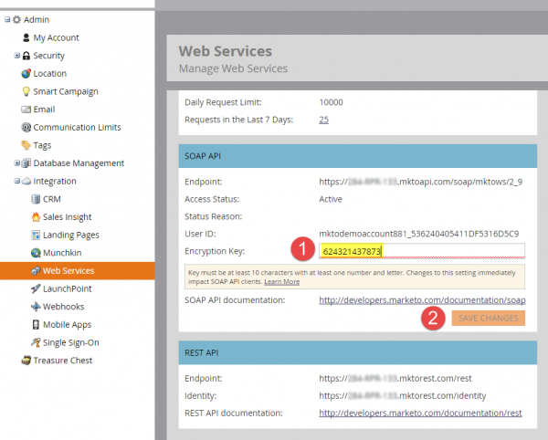

# SOAP API

SOAP La API de está en desuso y dejará de estar disponible a partir del 31 de octubre de 2025. Todo el nuevo desarrollo debe realizarse con la API de Marketo [REST](../rest-api/rest-api.md), y los servicios existentes deben migrarse para esa fecha a fin de evitar interrupciones en el servicio. SOAP SOAP Si cuenta con un servicio que usa la API de, consulte la [Guía de migración](./migration.md) de la API de para obtener información sobre cómo migrar.

## SOAP SDL

SOAP SOAP Para recuperar el documento de WSDL de la, obtenga su punto final de API de la en el menú **[!UICONTROL Administrador]** > **[!UICONTROL Integración]** > **[!UICONTROL Servicios web]**.

SOAP 

La URL de WSDL es:

`<SOAP API Endpoint> + ?WSDL`

No utilice el punto final definido en el WSDL. Cada instancia de Marketo tiene un punto final único al que realizar llamadas.

## Límites

- **Cuota diaria:** A la mayoría de las suscripciones se les asignan 10.000 llamadas API al día (que se restablecen diariamente a las 12:00 horas CST). Puede aumentar su cuota diaria a través de su administrador de cuentas.
- **Límite de velocidad:** Acceso a API por instancia limitado a 100 llamadas por 20 segundos.
- **Límite de simultaneidad:**  Máximo de diez llamadas API simultáneas.

Nuestra recomendación es que los tamaños de lote no sean más grandes que 300. Los tamaños más grandes no son compatibles y pueden provocar tiempos de espera y, en casos extremos, restricciones.

## SOAP Configuración de API de en Marketo

1. Vaya a la sección **[!UICONTROL Admin]** y haga clic en **[!UICONTROL Servicios web]**.

1. SOAP SOAP Establezca una [!UICONTROL clave de cifrado] adecuada, haga clic en **[!UICONTROL Guardar cambios]** y use los valores de [!UICONTROL Extremo], [!UICONTROL Id. de usuario] y [!UICONTROL Clave de cifrado] de la API para generar la [firma de autenticación](authentication-signature.md) correcta para cada llamada a la API.

